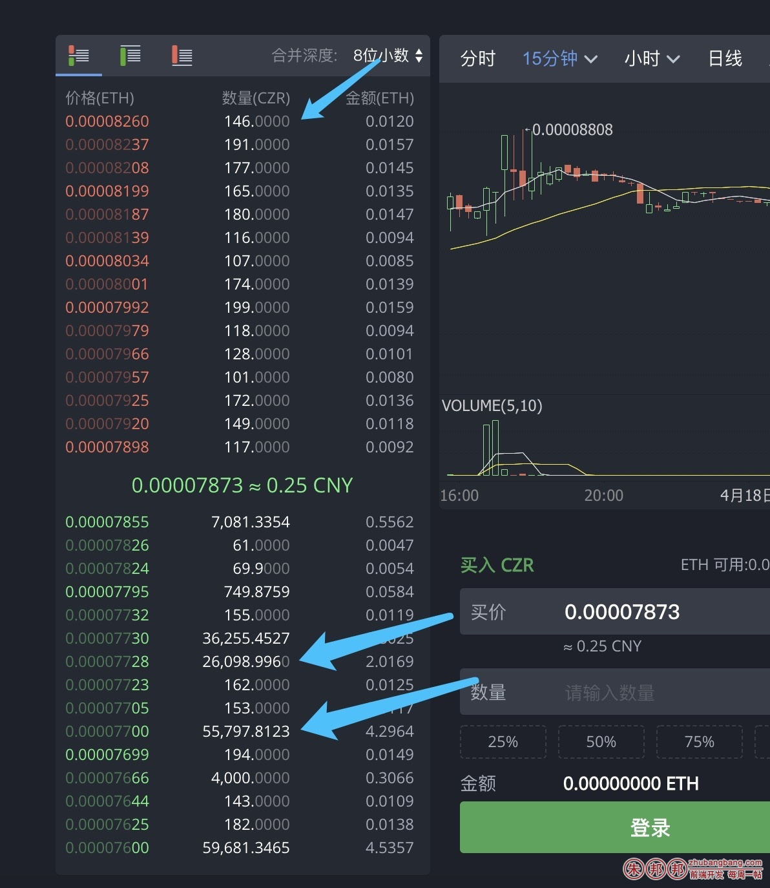

比如挂单的数量中，

523.0000 则前面523.正常颜色显示，后面0000则淡颜色显示；

方便用户的识别；



具体需要的数据结构是：

```
523.0000==>”523.”，”0000″
1,523.9900==>”1,523.99″，”00″
1,523.1234==>”1,523.1234″，””
1,523.0900==>”1,523.09″，”00″
```

下面是演示的DEMO，我是使用正则做的；

```javascript
var str1='523.0000';        //需要结果  "523."，         "0000"
var str2='1,523.9900';      //需要结果  "1,523.99"，     "00"
var str3='1,523.1234';      //需要结果  "1,523.1234"，   ""
var str4='1,523.0900';      //需要结果  "1,523.09"，     "00"
var str5='2222.34';         //需要结果  '222.34',       '00'
var str6='1,523,234.3400';  //需要结果  '1,523,234.34'  '00'
 
 
var reg=/^(\d+(?:,\d{3})*\.(?:0*[1-9]+)?)(0*)?$/;
var result1=reg.exec(str1);
var result2=reg.exec(str2);
var result3=reg.exec(str3);
var result4=reg.exec(str4);
var result5=reg.exec(str5);
var result6=reg.exec(str6);
 
console.log(result1);//[ '523.0000', '523.', '0000', index: 0, input: '523.0000' ]
console.log(result2);//[ '1,523.9900', '1,523.99', '00', index: 0, input: '1,523.9900' ]
console.log(result3);//[ '1,523.1234', '1,523.1234', undefined, index: 0, input: '1,523.1234' ]
console.log(result4);//[ '1,523.0900', '1,523.09', '00', index: 0, input: '1,523.0900' ]
console.log(result5);//[ '2222.34', '2222.34', undefined, index: 0, input: '2222.34' ]
console.log(result6);//[ '1,523,234.3400', '1,523,234.34', '00', index: 0, input: '1,523,234.3400' ]
 
console.log("---------");
console.log(filterAry(result1));//[ '523.', '0000' ]
console.log(filterAry(result2));//[ '1,523.99', '00' ]
console.log(filterAry(result3));//[ '1,523.1234', '' ]
console.log(filterAry(result4));//[ '1,523.09', '00' ]
console.log(filterAry(result5));//[ '2222.34', '' ]
console.log(filterAry(result6));//[ '1,523,234.34', '00' ]
 
function filterAry(ary) {
    return [ary[1],ary[2]?ary[2]:'']
}
```
核心代码就一行

```javascript
var reg=/^(\d+(?:,\d{3})*\.(?:0*[1-9]+)?)(0*)?$/;
```
具体的应用根据实际的场景进行写，上面仅仅是DEMO
