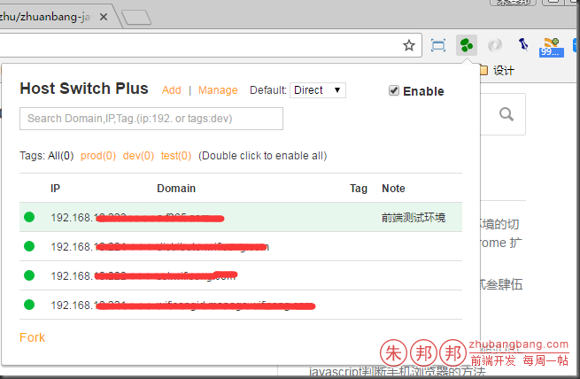

前端开发的过程中；

发布文件的时候，经常会遇到在测试环境和正式环境之间切换的情况；

以前用的是`“SwitchHosts”`这个小工具；

开发时，链接测试环境；

文件发布后，链接正式环境进行测试；（在不同的环境下配置不同的`host`；）

推荐用 `chrome` 浏览器的扩展应用【`Host Switch Plus`】

（除了 `Chrome` 之外，支持如百度、360 等支持 webkit 内核的浏览器）。

插件目的：通过该 `Chrome` 插件，快捷方便的切换、设置 `hosts` 代理规则，而不用修改系统 `hosts` 文件，方便web开发人员在 测试/开发/线上 等环境快速切换；同时顺便支持本地端口的代理设置；

作用：支持直接在 `Chrome` 浏览器插件 Popup 弹出层中启用/禁用设置好的各种代理规则；批量增加/删除代理规则；编辑修改代理规则；支持IP(端口号)以及域名（通配符）的代理设置。

优点：管理方便；启用/禁用操作实时生效；可配合 Fiddler、ShadowSocks 等实现仅针对单个浏览器或者单个域名的代理设置。-

插件下载地址：http://pan.baidu.com/s/1nvTP8vB （如果不能下载，请留言）