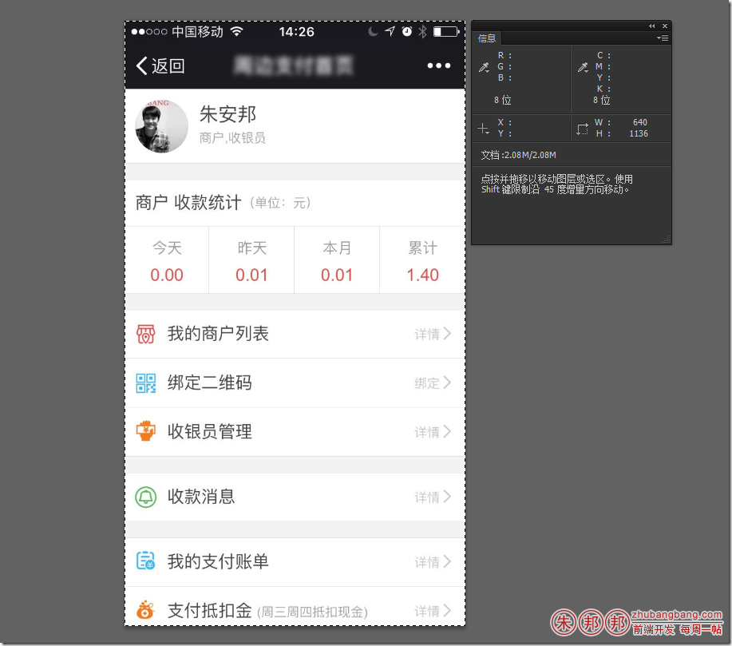
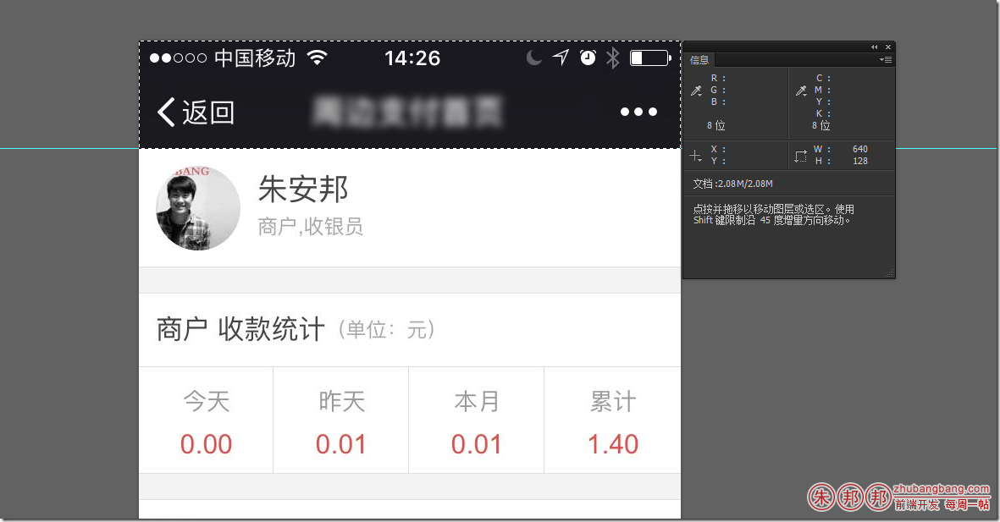
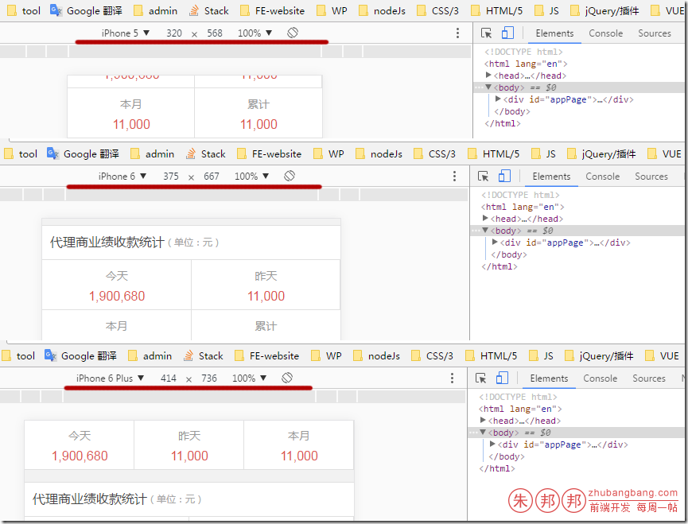
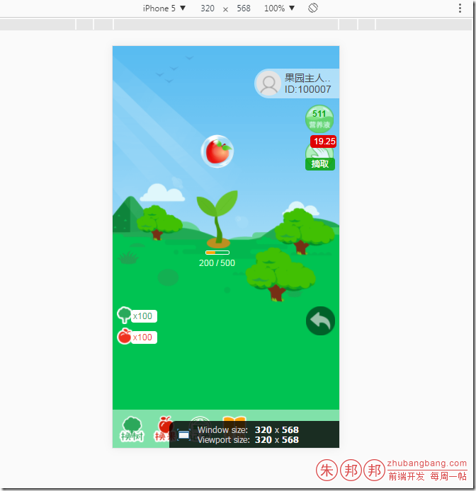
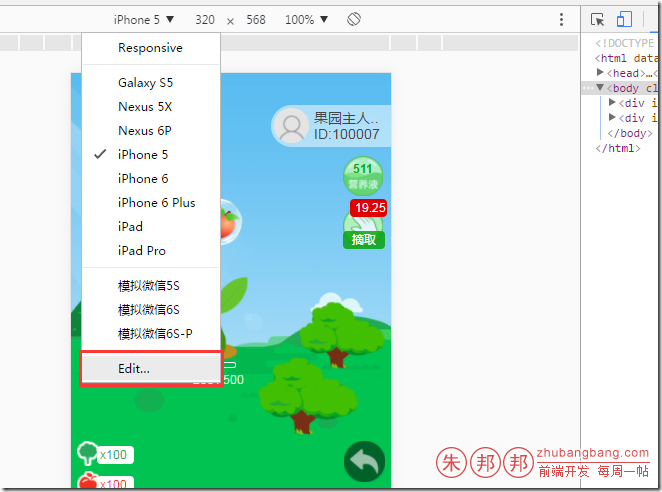
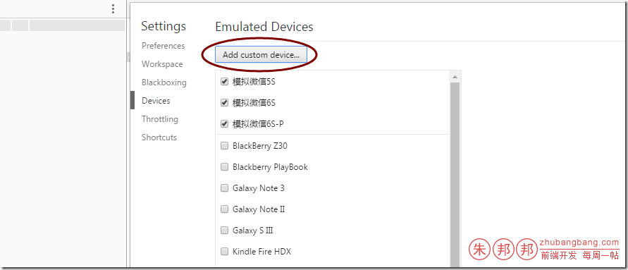
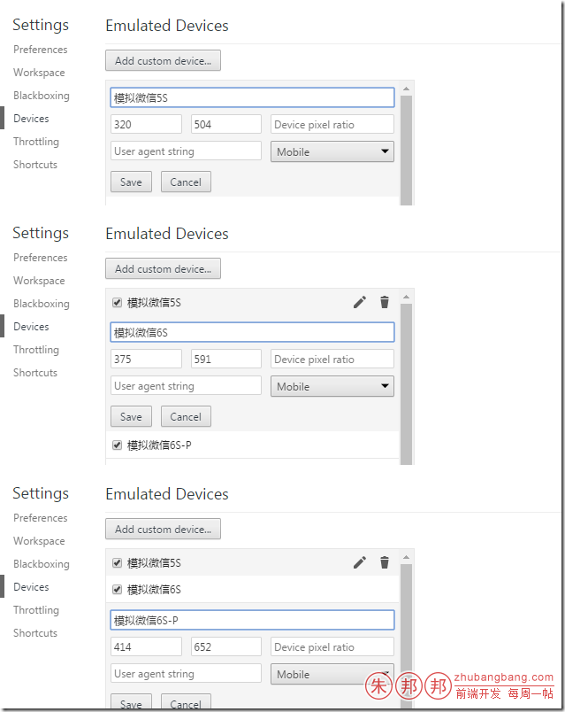
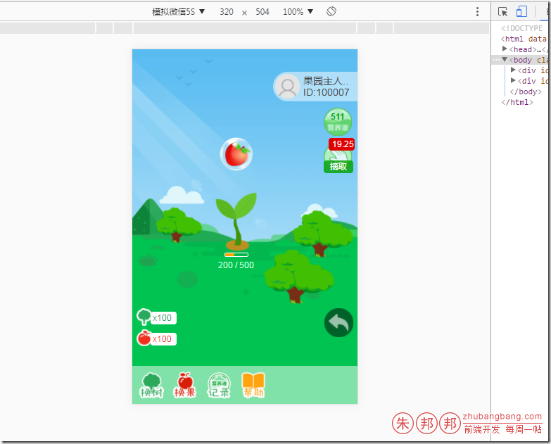
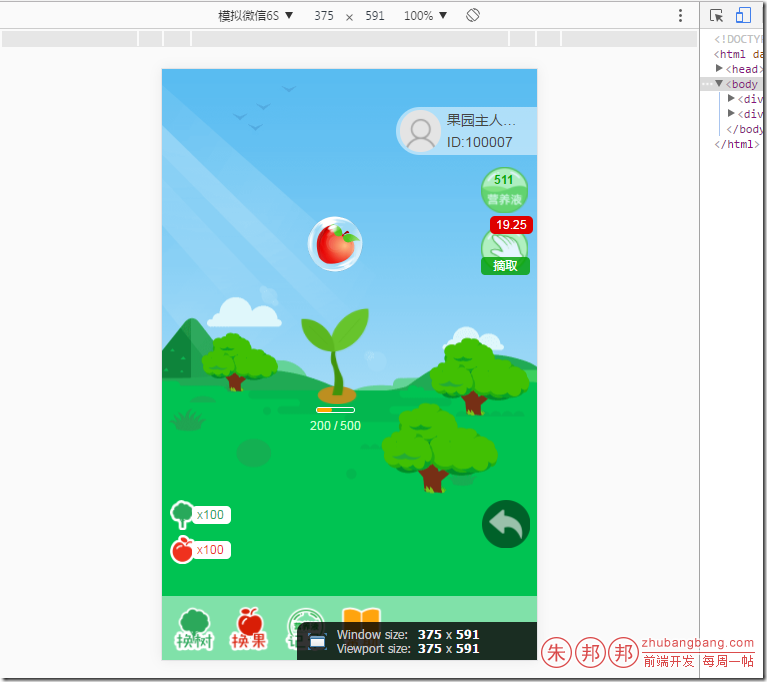
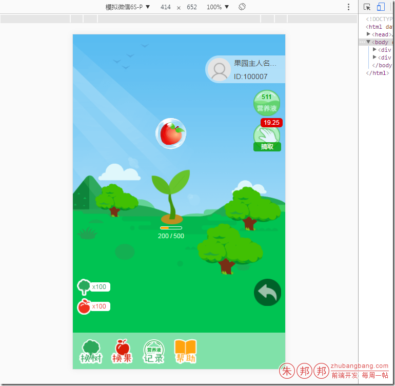

微信内置的浏览器上面会有一个黑色条；

比如5S页面的分辨率是：640*1136

顶部黑色条的尺寸是 640*128px

chrome的默认手机预览尺寸如下

如果再做一些特殊页面定位的时候（比如宽度和高度与屏幕相同，上下左右不可移动的时候），这种预览就很不好；会影响你的布局判断；

比如下面这种布局看不到直观的效果；

可以配置下大小就可以了；

点击编辑页面；

然后添加设备

我配置的大小如下；

5/5s：320px

6/6S：375px

6SP：414px

按照比例转过去即可

这样就可以预览的差不多了；

