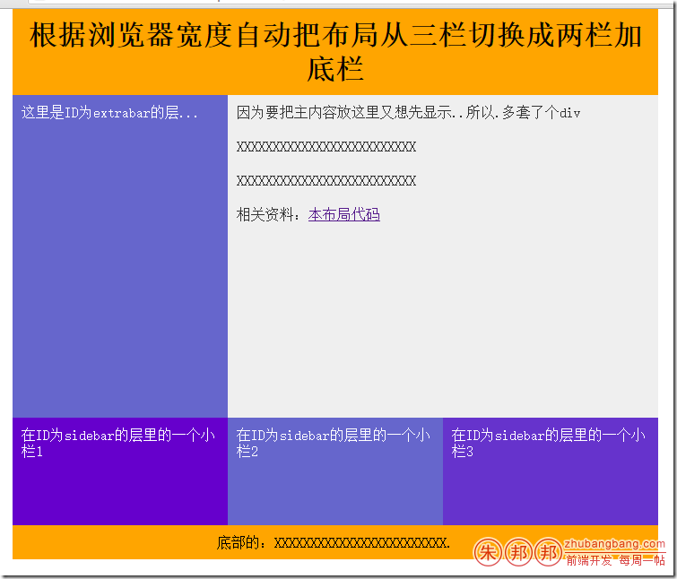
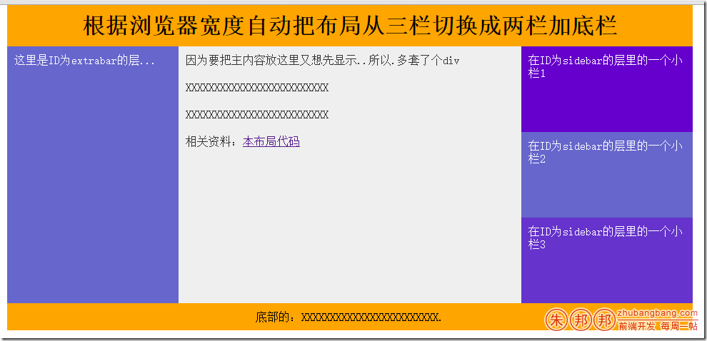

思路是开始布局一个界面；

然后做浮动；右侧三个DIV宽度相加等于左侧大的DIV宽度；

 

高度相加等于左侧大的DIV高度！

不在不同的宽度下有不同的表现；如下图





HTML代码如下：

 
```html
    <body>
    <div id="wrapper" class="minwidth">
        <!--顶部-->
        <div id="header">
            <h1>根据浏览器宽度自动把布局从三栏切换成两栏加底栏</h1>
        </div>
        <!--左侧和中间的-->
        <div id="main">
            <div id="extrabar">
                <p>这里是ID为extrabar的层...</p>
            </div>
            <div id="content">
                <p>因为要把主内容放这里又想先显示..所以.多套了个div</p>
                <p>XXXXXXXXXXXXXXXXXXXXXXXXX</p>
                <p>XXXXXXXXXXXXXXXXXXXXXXXXX</p>
                <p>相关资料：<a title="关于脚本使用的相关说明." href="#">本布局代码</a></p>
            </div>
        </div>
        <!--要活动的DIV-->
        <div id="sidebar">
            <div class="box s1">
                <p>在ID为sidebar的层里的一个小栏1</p>
            </div>
            <div class="box s2">
                <p>在ID为sidebar的层里的一个小栏2</p>
            </div>
            <div class="box s3">
                <p>在ID为sidebar的层里的一个小栏3</p>
            </div>
        </div>
        <div id="footer">
            <p>底部的：XXXXXXXXXXXXXXXXXXXXXXXX.</p>
        </div>
    </div>
    </body>
```
CSS代码如下：
```css
<style type="text/css">
    *{ margin:0; padding:0}
    body{ text-align:left;}
    #wrapper{margin: 0 auto;}
    #header,#footer{clear:both;text-align:center;background: orange;}
    /*主要CSS*/
    #main{float:left;width:720px;}
        /*左侧边栏的小DIV*/
    #extrabar{  float:left;  width:240px;  height:360px;  color:#fff;  background-color:#6666CC;  }
        /*中间栏的大DIV*/
    #content{  float:right;  width:480px;  height:360px;  color:#333;  background-color:#efefef;  }
    /*浮动的box设置*/
    #sidebar{ float:left;}
    .box{  float:left;  width:240px;  height:120px;  }
    /*小宽和大宽*/
    .minwidth{  width:720px;  }
    .maxwidth{  width:960px;  }
    /*小宽和大宽分别对应的边栏宽度*/
    .minwidth #sidebar{  width:720px;  }
    .maxwidth #sidebar{  width:240px;  }
    /*浮动DIV的设置*/
    .s1{  color:#fff;  background-color:#6600CC;  }
    .s2{  color:#fff;  background-color:#6666CC;  }
    .s3{  color:#fff;  background-color:#6633CC;  }
    /*通用样式*/
    h1,p{padding:10px;}
</style>
```

JavaScript代码如下：

```js
<script>
    wraphandler = {
        init: function() {//init（初始化）
            wraphandler.setWrapper();
            wraphandler.addEvent(window,"resize",wraphandler.setWrapper);
        },
        setWrapper: function() {//设置wrapper的DOM结果
            var theWidth;
            if (window.innerWidth) {//下面是innerWidth的兼容写法,innerWidth是不兼容的
                theWidth = window.innerWidth
            } else if (document.documentElement&&document.documentElement.clientWidth) {
                theWidth = document.documentElement.clientWidth
            } else if (document.body) {
                theWidth = document.body.clientWidth
            };
            if (theWidth != 0) {//下面是主代码
                if (theWidth < 1000) {
                    document.getElementById('wrapper').className = 'minwidth';
                } else {
                    document.getElementById('wrapper').className = 'maxwidth';
                }
            }
        },
        addEvent: function( obj, type, fn ) {//DOM二级事件；
            //DOM二级事件有兼容性问题；addEventListener在IE里不好使；
            if ( obj.attachEvent ) {
                obj['e'+type+fn] = fn;
                obj[type+fn] = function(){obj['e'+type+fn]( window.event );};
                obj.attachEvent( 'on'+type, obj[type+fn] );
            } else {
                obj.addEventListener( type, fn, false );
            }
        }
    };
    wraphandler.addEvent(window,"load",wraphandler.init);
    /*HTML DOM innerheight、innerwidth 属性
    只读属性，声明了窗口的文档显示区的高度和宽度，以像素计。
    这里的宽度和高度不包括菜单栏、工具栏以及滚动条等的高度。
    IE 不支持这些属性。它用 document.documentElement 或 document.body （与 IE 的版本相关）的 clientWidth 和 clientHeight 属性作为替代。*/
</script>
```