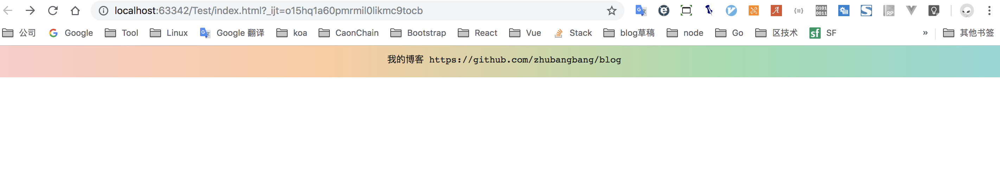

小清新风格的动态渐变背景；

用在顶部Tips，做全站提示；



DEMO如下

```html
<!DOCTYPE html>
<html>
<head>
    <meta charset="UTF-8">
    <title>Title</title>
    <style>
        .devcon-badge {
            width: 100%;
            position: fixed;
            top: 0;
            height: 45px;
            z-index: 100;
            background: linear-gradient(90deg,#fca09a,#fcccd3,#ffcc9d,#98ddad,#81d7ec,#a0aaed);
            background-size: 200%;
            text-align: center;
            -webkit-animation: GradientAnimation 5s ease infinite;
            -moz-animation: GradientAnimation 5s ease infinite;
            animation: GradientAnimation 5s ease infinite
        }
        .devcon-badge:hover {
            -webkit-animation-duration: 2s;
            -moz-animation-duration: 2s;
            animation-duration: 2s
        }

        .devcon-badge a {
            color: #222;
            font-family: monospace;
            text-decoration: none;
            display: block;
            padding: 10px 0
        }
        @-webkit-keyframes GradientAnimation {
            0%,100% {
                background-position: 0 50%
            }

            50% {
                background-position: 100% 50%
            }
        }

        @-moz-keyframes GradientAnimation {
            0%,100% {
                background-position: 0 50%
            }

            50% {
                background-position: 100% 50%
            }
        }

        @keyframes GradientAnimation {
            0%,100% {
                background-position: 0 50%
            }

            50% {
                background-position: 100% 50%
            }
        }
    </style>
</head>
<body>
<div class="devcon-badge"><a href="https://github.com/zhubangbang/blog">我的博客 https://github.com/zhubangbang/blog</a></div>
</body>
</html>
```