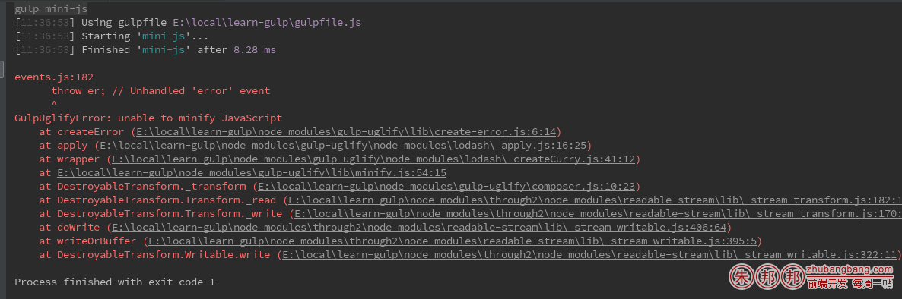
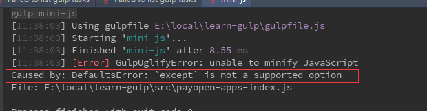

如果您的 gulp-uglify3 版本是3.0.0的请注意修改配置，否则将会导致报错；

我遇到的报错是：

``` 
GulpUglifyError: unable to minify JavaScript
```
具体的是

``` 
DefaultsError: `except` is not a supported option
```
查看当前 gulp-uglify 版本，

```
"gulp-uglify": "^3.0.0"
```

在执行gulp任务到时候；

```javascript
gulp.task('mini-js', function () {
    // 1. 找到文件
    gulp.src('src/*.js')
    // 2. 压缩文件
    .pipe(uglify({
        mangle: {except: ['require', 'exports', 'module', '$']}//排除混淆关键字
    }))
    // 3. 另存压缩后的文件
    .pipe(gulp.dest('dist/'))
});
```
会提示

```javascript
GulpUglifyError: unable to minify JavaScript
```
具体的如下；




我使用了 ‘gulp-util’监看具体的错误

```javascript
gulp.task('mini-js', function () {
    // 1. 找到文件
    gulp.src('src/*.js')
    // 2. 压缩文件
    .pipe(uglify({
        mangle: {except: ['require', 'exports', 'module', '$']}//排除混淆关键字
    }))
    .on('error', function (err) {
        gutil.log(gutil.colors.red('[Error]'), err.toString());
    })
    // 3. 另存压缩后的文件
    .pipe(gulp.dest('dist/'))
});
```



``` 
`DefaultsError: `except` is not a supported option`
```
发现except参数不被支持了；

然后爬了下文档，

[文档](https://github.com/terinjokes/gulp-uglify)

发现文档里，没有说

尼玛，这么什么情况！！！！

爬了下stackoverflow：看到一个说明：

https://stackoverflow.com/questions/31694685/make-gulp-uglify-not-mangle-only-one-variable

`NB: If you are using gulp-uglify ^3.0.0 please replace except with reserved eg:`

注意：如果你使用gulp-uglify 3.0.0 ，请使用 `reserved` 代替`except` ；

``` 
.pipe( uglify({ mangle: {reserved: [‘jQuery’]} }) ) // for gulp-uglify ^3.0.0
```
我把 except 改为  reserved ；运行后，没问题了；

目前我google搜到的所有中文文档都没有提这个API的更改；

except这么重要的参数移除了，都不在API里提一下，真的醉了！！！

