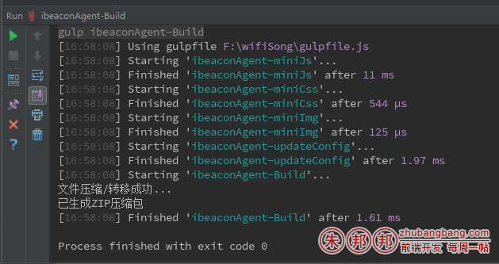

需要注意任务的顺序问题；

代码如下

1、依赖的包

```javascript
'use strict';
var gulp = require('gulp');
var scp = require('gulp-scp2');//上传到服务器，相当于全部文档全部复制
var uglify = require('gulp-uglify');//获取 uglify 模块（用于压缩 JS）;
var cleanCSS = require('gulp-clean-css');//gulp-minify-css 已经不推荐使用 https://github.com/scniro/gulp-clean-css
const zip = require('gulp-zip');
var gulpRreplace = require('gulp-replace');
```
2、时间戳生成、文件来源配置

```javascript
var nowDate = new Date(),
    nowYear=nowDate.getFullYear(),
    nowMonth=unshiftZero(nowDate.getMonth()+1),
    nowDay=unshiftZero(nowDate.getDate()),
    fullHours=unshiftZero(nowDate.getHours()),
    fullMinutes=unshiftZero(nowDate.getMinutes());
var nowTimeStr=nowYear+nowMonth+nowDay+fullHours+fullMinutes;
var ibeaconAgentJsAry=[
    'wifisong.resource/project/ibeacon-agent/src/payopen-special-merchant-statis.js',
    'wifisong.resource/project/ibeacon-agent/src/payopen-special-merchants.js',
    'wifisong.resource/project/ibeacon-agent/src/payopen-service_providers.js',
    'wifisong.resource/project/ibeacon-agent/src/payopen-statistic-wechat-bill.js',
    'wifisong.resource/project/ibeacon-agent/src/payopen-apps-index.js'
];
var ibeaconAgentCssAry=[
    // 'wifisong.resource/project/ibeacon-agent/css/shakemoney-device-bind.css'
];
var ibeaconAgentImgAry=[
    // 'wifisong.resource/project/ibeacon-agent/img/user-header.png'
];
```
3、任务配置

```javascript
gulp.task('ibeaconAgent-Build',['ibeaconAgent-miniJs','ibeaconAgent-miniCss','ibeaconAgent-miniImg','ibeaconAgent-updateConfig'], function () {
    console.log("文件压缩/转移成功...");
    gulp.src('../update-pack/ibeaconAgent/wifisong.resource/**/*',{ base: '../update-pack/ibeaconAgent' }) //待压缩的文件是存放在这个文件夹下的所有文件
        .pipe(zip('wifisong.resource.zip')) //输出的文件名
        .pipe(gulp.dest('../update-pack/ibeaconAgent/')); //输出到当前目录
    console.log("已生成ZIP压缩包");
});
 
gulp.task('ibeaconAgent-miniJs', function() {
    gulp.src(ibeaconAgentJsAry)
        .pipe(uglify({mangle: {reserved: ['require' ,'exports' ,'module' ,'$']}}))
        .pipe(gulp.dest('../update-pack/ibeaconAgent/wifisong.resource/project/ibeacon-agent/dist/'))
});
gulp.task('ibeaconAgent-miniCss', function () {
    gulp.src(ibeaconAgentCssAry)
        // .pipe(cleanCSS({compatibility: 'ie8'}))
        .pipe(cleanCSS())
        .pipe(gulp.dest('../update-pack/ibeaconAgent/wifisong.resource/project/ibeacon-agent/css/'))
});
gulp.task('ibeaconAgent-miniImg', function () {
    gulp.src(ibeaconAgentImgAry)
        .pipe(gulp.dest('../update-pack/ibeaconAgent/wifisong.resource/project/ibeacon-agent/img/'))
});
gulp.task('ibeaconAgent-updateConfig', function(){
    gulp.src(
        ['wifisong.resource/project/ibeacon-agent/config.js']
        // { base:'wifisong.resource/ssl/a/' }
    )
        .pipe(gulpRreplace('dev = true', 'dev = false'))
        .pipe(gulpRreplace('201604190444fffdddffff', nowTimeStr))
        .pipe(gulp.dest('../update-pack/ibeaconAgent/wifisong.resource/project/ibeacon-agent/'))
});
```
4、执行任务，webstorm集合了gulp；直接确定即可运行；

