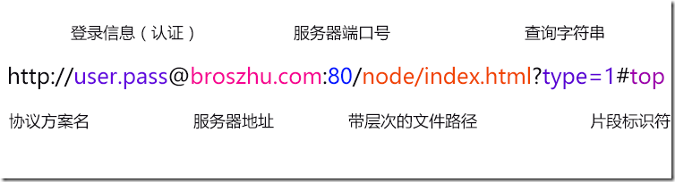

##### 客户端：能够发起请求的都叫客户端；浏览器，移动浏览器，linux，curl，微信QQ，等
##### 服务端：能够接受请求的都是叫服务器，需要在特定的机器（IP）上启动特定的端口（port）

### http协议:

人与人之间的交流需要
- 1，媒介，空气；
- 2，使用双方都能听懂的语言进行沟通；

计算机之间的交流A—B：
- 1，光纤，无线信号；
- 2，协议和一种数据封装格式；

### 普通网站的访问过程；

- 1，打开浏览器，输入网址确定后，向服务器发起请求；
- 2，客户端随机开启一个端口进行发送请求，进行域名解析；（浏览器里找缓存—》再操作系统里找—》然后再host文件里—》DNS调用–》到域名服务商的DNS缓存里找—》域名服务商给的域名解析到IP，然后发起DNS请求到IP；）
- 3，经过三次捂手与服务器连接；
- 4，正式发起HTTP请求的参数和路径；
- 5，服务器收到浏览器请求后，会解析路径和参数；
- 6，服务器将生成的页面作为HTTP响应的响应提，返回给客户端；
- 7，客户端接收到响应后，根据响应的内容，开始HTML解析；
- 8，如果解析过程中有外链文件，,JS,CSS,图片，视频等，会再次发服务器送请求；
- 9，浏览器用HTML和后面的CSS，JS进行渲染页面和绑定事件；
- 10，用户与页面交互的时候，还会执行响应的回调；页面的动态交互，通过JavaScript做出响应；
- 11，页面交互的过程中，可能会需要向服务器请求额外的数据；如果是局部获取数据，可以通过提交表单，走AJAX请求；



## 命令行里写

```
curl http://zhubangbang.com/ 可以访问8080端口；
```

```
curl -v http://zhubangbang.com/ 可以详细显示请求头和响应头；如下；
```

详细信息如下

```
*   Trying 103.254.149.117...
* Connected to zhubangbang.com (103.254.149.117) port 80 (#0)
请求头
> GET / HTTP/1.1
> Host: zhubangbang.com     请求的主机和端口
> User-Agent: curl/7.47.0   客户端版本
> Accept: */*               可以接受的文件类型；

响应
> 
< HTTP/1.1 302 Found
< Server: nginx
< Date:  Tue, 24 Nov 2015 16:01:29 GMT
< Content-Type: text/html; charset=iso-8859-1
< Content-Length: 208
< Connection: keep-alive
< Location: https://zhubangbang.com/
< 
<!DOCTYPE HTML PUBLIC "-//IETF//DTD HTML 2.0//EN">
<html><head>
<title>302 Found</title>
</head><body>
<h1>Found</h1>
<p>The document has moved <a href="https://zhubangbang.com/">here</a>.</p>
</body></html>
* Connection #0 to host zhubangbang.com left intact
```

### 设置头

```
curl -H “name:broszhu” -v http://localhost:8080 可以设置头；（用的是冒号）
```
信息如下

```
> GET / HTTP/1.1
> Host: localhost:8080
> User-Agent: curl/7.44.0
> Accept: */*
> name:broszhu
>
< HTTP/1.1 200 OK
< Date: Tue, 24 Nov 2015 16:09:46 GMT
< Connection: keep-alive
< Transfer-Encoding: chunked
```

头是可以设置多个的；
```
curl -H “name:broszhu” –H “age:25” -v http://localhost:8080
```

请求：

- 1、基础HTTP协议；
- 2、请求首部；
    - Contection：keep-alive 保持连接，相当于保持连接不中断
    - Content-Type：设置文本格式请求
    - Content-Length：请求的长度，Content-Length:19   name=broszhu&&age=6;请求长度也会决定请求的方式