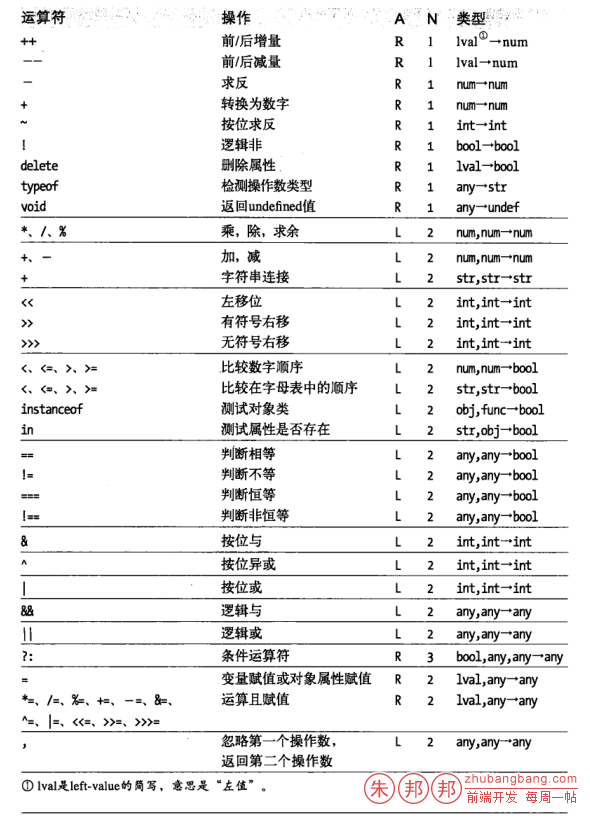

在群里看到一个人发的问题；

看着很唬人的，仔细看下，发现是一个关于计算优先级的问题；

```javascript
var i=4;
if(i+=66&&i++){
    console.log(i);
}
```
这个题目看着唬人，其实不难的，但是对基础的综合应用还是有帮助的；

实际项目中不会出现这样的代码，但是这背后的运算逻辑却值得一记；

豆芽长的再高，也就是一盘菜；

```javascript
<script>
    var i=4;
    if(i+=66&&i++){
        console.log(i);//8
    }
 
    /*
    * i+=66&&i++
    * 1、i+=(66&&i++) ->
    *       66&&i++   ->
    *       true&&i++ -> 注：&&前一个表达式为true时，则取值为&&后面的表达式值
    *       i++       -> 此时i还是为4
    *       4         -> 需要明白i++ 和++i的区别；
    * 2、i+=4
    *    i=i+4
    *    i=4+4
    *    i=8
    * 3、if(i=8){console.log(i);}
    *
    * */
</script>
```

上面已经写了运算原理；

现在再逐步说明下

1、`i+=66&&i++` 这个表达式首先需要明白&&的优先级是大于`+=`的，所以可以写为 `i+=(66&&i++)` ；

2、 `i+=(66&&i++)` 中，这里涉及了`&&`的取值问题，`66`的布尔值是`true`，所以是`true&&i++`，这里还需要明白`i++`和`++i`的运算区别；一个是先运算后赋值，一个是先赋值后运算；

此时`i`还是`4`；所以表达式就是`i+=4`;

3、`i+=4`;这个就比较简单了；就是`i=i+4`;也就是`i=4+4`；结果就是`i=8`;

4、`if(i=8){console.log(i)}`，这个`i=8`的表达式在布尔值运算肯定是`true`；可以手动试试`Boolean(i=8)` 看看值；

5、结果`i`的值就是`8`了；

注意：这里的`66`是没有任何鸟用的，就是来影响别人思维的；你在这里写为任何一个为true的值都不影响结果，比如你写为`1000000000`也是不影响结果的；

当然如果你把66改为false的，那结果就不一样了；比如你把66该为0；

```javascript
var i=4;
if(i+=0&&i++){
    console.log(i);
}
```

也就是，这时候i是4了；

另一种情况：如果你把里面的i++改为++i;结果就不是8，而是9了；因为++i是自己先赋值，然后再和别的运算，这点也是需要明白的；

关于不同表达式的优先级，参见下图

（截图出自JavaScript权威指南）

