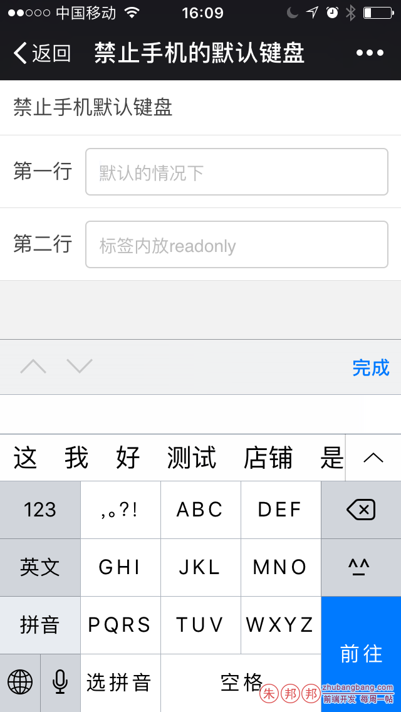
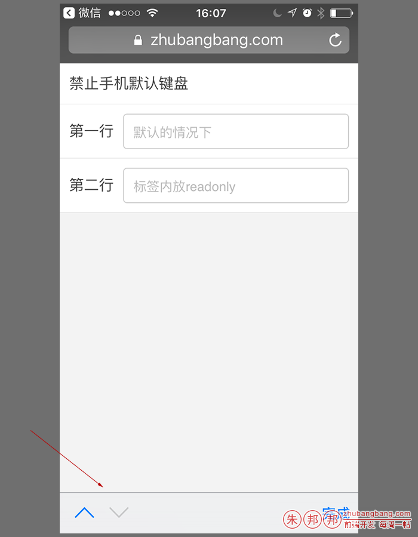

推荐使用`document.activeElement.blur()`;这个方法来处理这种禁止弹出手机默认键盘的操作

看一下DEMO：

https://zhubangbang.com/demo/disable-the-phone-default-keyboard/index.html

可以手机上打开上面链接，访问看看效果；

在手机端开发的时候，户点击input的时候；

会默认调出手机软键盘；如下图



需求：文本框获取焦点时，需要禁止手机弹出自带的输入键盘；（可能并非单纯的禁用，比如可能是调用自己设置的控件，或者调用微信扫描接口等，反正就是禁用后，这里还需要显示文本）

### 方法一：使用readonly，把input设置为只读属性，这样就可以禁止弹出默认键盘了；

`readonly`只是针对文本输入框这类可以输入文本的输入项，如果设为`true`，用户只是不能编辑对应的文本，但是仍然可以聚焦焦点，并且在提交表单的时候，该输入项会作为`form`的一项提交。

`readonly`需要与`disable`做区分；

如果一个输入项的`disabled`设为`true`，则该表单输入项不能获取焦点，用户的所有操作（鼠标点击和键盘输入等）对该输入项都无效，最重要的一点是当提交表单时，这个表单输入项将不会被提交。

`readonly`只针对`input(text / password)和textarea`有效，而`disabled`对于所有的表单元素都有效，包括`select, radio, checkbox, button`等。

`readonly`虽然可以禁止弹出键盘，但是有兼容性问题，比如还会弹出一条东西（上下箭头和完成的那部分），



### 方法二、用一个p/div等标签显示内容；然后放一个隐藏的input；

如果你想着用`disable`，禁止当前的`input`，那么完全可以选择用一个`p/div/span`等标签，用户点击这个区域的时候，调用你的第三控件等事情，完成后，JS赋值隐藏的`input`值和当前显示的文本；

这样用户的体验是：点击了某个区域（这个区域你可能做的和其它`input`标签差不多），进行操作后，操作的结果显示在页面上了；

### 方法三、使用document.activeElement.blur();

这是让获得焦点的元素失去焦点；

你可以在`<body>标签中加入了onload=”document.activeElement.blur();”`

不过这种处理的话就太粗暴了；

我个人推荐下面这种用法
```javascript
$form.on("focus","input[name=qrCode]",function(){
    document.activeElement.blur();//屏蔽默认键盘弹出；
});
```
上面这段代码的时候，是当 [name=qrCode] 这个input获得焦点的时候；

把判断键盘给屏蔽掉；

iPhone和安卓手机测试可以；

当然如果您还有其它事情要处理，可以写在下面；

比如我的应用场景是；

如果点击了当前`input`，触发另外一个事件（那个触发的事件是打开微信扫一扫功能的）；
```javascript
//点击绑定二维码
$form.on("focus","input[name=qrCode]",function(){
    document.activeElement.blur();//屏蔽默认键盘弹出；
    $page.find(".j-scan-btn").trigger("click");
});
```
用户点击”绑定二维码”按钮后，会调用微信的扫一扫，获得二维码信息显示在当前的input上；

如果点击input这个标签或点击”绑定二维码”，都会再进入扫一扫；

用户并不能编辑当前的input区域；

看一下DEMO：

https://zhubangbang.com/demo/disable-the-phone-default-keyboard/index.html

可以手机上打开上面链接，访问看看效果；

~~