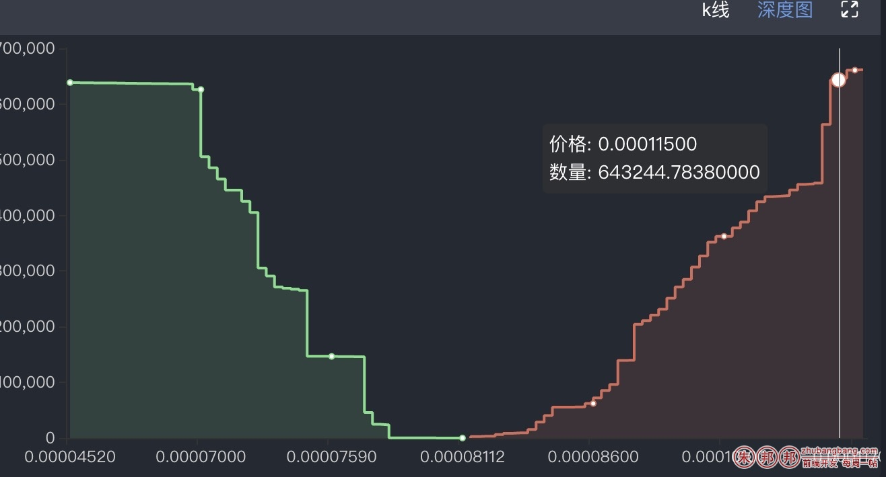

场景：深度图的数据整理；

因为是频繁更换的，所以执行效率一定要优化到最好，功能实现只是最基本的要求；

如下图片的应用场景，很多炒股炒币的人应该非常熟悉，交易所里都会用到的；



卖盘的DEMO源数据如下

```javascript
// 卖盘，原始数据 按照价格从低到高排序（价格升序）；
var sellAry = [
    // { "price": 0.00010, "number": 3, "heji": 123.980 },
    { "price": 0.00021, "number": 10.1, "heji": 123.980 },
    { "price": 0.00022, "number": 20.2, "heji": 123.980 },
    { "price": 0.00023, "number": 30.3, "heji": 123.980 },
    { "price": 0.00024, "number": 30.4, "heji": 123.980 },
    { "price": 0.00025, "number": 30.5, "heji": 123.980 },
    { "price": 0.00026, "number": 30.6, "heji": 123.980 },
    { "price": 0.00027, "number": 30.7, "heji": 123.980 },
    { "price": 0.00028, "number": 30.8, "heji": 123.980 },
    { "price": 0.00029, "number": 30.9, "heji": 123.980 },
    { "price": 0.00030, "number": 30.1, "heji": 123.980 }
];
```

买盘的DEMO数据如下；


```javascript
// 买盘，原始数据 按照价格从低到高排序（价格升序）；
var buyAry = [
    { "price": 0.00002, "number": 20.37, "heji": 10 },
    { "price": 0.00003, "number": 16.16, "heji": 10 },
    { "price": 0.00004, "number": 15.72, "heji": 10 },
    { "price": 0.00005, "number": 14.16, "heji": 10 },
    { "price": 0.00006, "number": 13.46, "heji": 10 },
 
    { "price": 0.00007, "number": 12.1, "heji": 10 },
    { "price": 0.00008, "number": 11.2, "heji": 10 },
    { "price": 0.00009, "number": 10.3, "heji": 10 },
    { "price": 0.00010, "number": 5.4,   "heji": 123.980 },
    { "price": 0.00011, "number": 2.5, "heji": 3.08 }
];
```

要求的数据：需要三个数组

- 价格数组：从底到高
- 买盘数组：取前N条数据进行累加排序（DEMO里假设5条）
- 卖盘数组：取前N条，累加排序；

注意累加的顺序；**因为是频繁更换的，所以执行效率一定要优化到最好**

代码如下；

```javascript
// 卖盘，原始数据 按照价格从低到高排序（价格升序）；
var sellAry = [
    // { "price": 0.00010, "number": 3, "heji": 123.980 },
    { "price": 0.00021, "number": 10.1, "heji": 123.980 },
    { "price": 0.00022, "number": 20.2, "heji": 123.980 },
    { "price": 0.00023, "number": 30.3, "heji": 123.980 },
    { "price": 0.00024, "number": 30.4, "heji": 123.980 },
    { "price": 0.00025, "number": 30.5, "heji": 123.980 },
    { "price": 0.00026, "number": 30.6, "heji": 123.980 },
    { "price": 0.00027, "number": 30.7, "heji": 123.980 },
    { "price": 0.00028, "number": 30.8, "heji": 123.980 },
    { "price": 0.00029, "number": 30.9, "heji": 123.980 },
    { "price": 0.00030, "number": 30.1, "heji": 123.980 }
];
 
// 买盘，原始数据 按照价格从低到高排序（价格升序）；
var buyAry = [
    { "price": 0.00002, "number": 20.37, "heji": 10 },
    { "price": 0.00003, "number": 16.16, "heji": 10 },
    { "price": 0.00004, "number": 15.72, "heji": 10 },
    { "price": 0.00005, "number": 14.16, "heji": 10 },
    { "price": 0.00006, "number": 13.46, "heji": 10 },
    { "price": 0.00007, "number": 12.1, "heji": 10 },
    { "price": 0.00008, "number": 11.2, "heji": 10 },
    { "price": 0.00009, "number": 10.3, "heji": 10 },
    { "price": 0.00010, "number": 5.4,   "heji": 123.980 },
    { "price": 0.00011, "number": 2.5, "heji": 3.08 }
];
function deepSort(buyAry,sellAry) {
    //作为数据使用
    var xAxisData=[],
        buyData=[],
        sellData=[];
    //处理浮点数相加的方法
    var addPro=function (arg1, arg2) {
        arg1 = arg1.toString();
        arg2 = arg2.toString();
        var arg1Arr = arg1.split("."),
            arg2Arr = arg2.split("."),
            d1 = arg1Arr.length == 2 ? arg1Arr[1] : "",
            d2 = arg2Arr.length == 2 ? arg2Arr[1] : "";
        var maxLen = Math.max(d1.length, d2.length);
        var m = Math.pow(10, maxLen);
        var result = Number(((arg1 * m + arg2 * m) / m).toFixed(maxLen));
        var d = arguments[2];
        return typeof d === "number" ? Number((result).toFixed(d)) : result;
    };
    //如果买盘数据>0,处理买盘数据
    buyAry.reverse();
    buyAry.length>0 && buyAry.slice(0, 5).forEach(function (item) {
        var preVal=buyData[0] || 0;
        xAxisData.unshift(item['price']);
        buyData.unshift(addPro(preVal,item['number']))
    });
    //如果卖盘数据>0, 处理卖盘数据
    sellAry.length>0 && sellAry.slice(0, 5).forEach(function (item,index) {
        var preVal=sellData[index-1] || 0;
        xAxisData.push(item['price']);
        sellData.push(addPro(preVal,item['number']));
        buyData.push(null)
    });
    console.log(xAxisData);
    console.log(buyData);
    console.log(sellData);
}
deepSort(buyAry,sellAry);
```

总结：
- 1.注意累加的顺序，卖盘是价格越高，累加的值越大，买盘是价格越低累加的值越大
- 2.注意买盘的价格补null；
- 3.注意累加的浮点数处理；
- dep4.注意性能；

如果有更优秀的写法，欢迎告诉我；非常感谢；