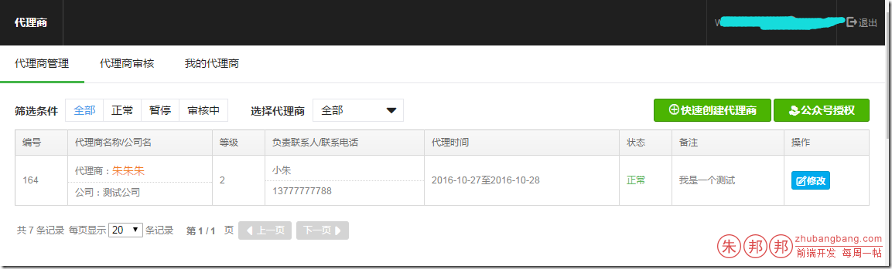

页面效果paging+loading+HTML；



点击触点（筛选条件），切换不同的状态（AJAX获取）；并且进行分页显示；

引入的CSS文件
```html
<link href=”http://a.xxx.com/wui/loading/css/loading.css” rel=”stylesheet” type=”text/css”/>
<link href=”http://a.xxx.com/wui/paging/css/paging.css” rel=”stylesheet” type=”text/css”/>
```
引入JS文件：
```javascript
var Page = require("page");
var loading = require("loading");
var juicer = require("juicer");
```
准备的相关
```javascript
var listTpl = juicer(['{@if count === 0}',
    '<tr>',
    '<td colspan="8" style="text-align:center">',
    '暂无记录,请添加',
    '</td>',
    '</tr>',
    '{@else}',
    
    '{@each data as item,index}',
    '<tr data-agent_id="${item.agent_id}">',
    '    <td>${item.agent_id}</td>',
    '    <td>','       <ul class="wui-list wui-list-nosquare">',
    '           <li class="wui-list-item">代理商：<span class="wui-txt-sm wui-txt-warning">${item.name}</span></li>',
    '           <li class="wui-list-item">公司：${item.corp_name}</li>',
    '       </ul>',
    '    </td>',
    '    <td>${item.level}</td>',
    '    <td>',
    '       <ul class="wui-list wui-list-nosquare">',
    '           <li class="wui-list-item">${item.linkman}</li>',
    '           <li class="wui-list-item">${item.mobile}</li>',
    '       </ul>',
    '    </td>',
    '    <td>${item.agent_start}至${item.agent_end}</td>',
    '    <td>',
    '{@if item.state === 1}',
    '        <span class="wui-txt-success">正常</span>',
    '{@else if item.state === 0}',
    '        <span class="wui-txt-muted">未知</span>',
    '{@else if item.state === 2}',
    '        <span class="wui-txt-danger">暂停</span>',
    '{@else if item.state === 4}',
    '        <span class="wui-txt-primary">审核中</span>',
    '{@else if item.state === 8}',
    '        <span class="wui-txt-warning">审核不通过</span><a href="javascript:;" class="wui-txt-muted j-agent-check-help"><i class="iconfont wui-txt-sm">&#xe60e;</i>查看原因</a>',
    '<div style="display:none;">', '<div class="check_info_txt" style="padding: 10px;">',
    '{@each item.check_info as item2,index}',
    '<div class="checkinfo-text">',
    '${item2.info}',
    '</div>',
    '{@/each}',
    '</div>', '</div>',
    '{@/if}',
    
    '    </td>',
    '    <td>${item.remark}</td>',
    '    <td><a href="/hr/agentedit?agent_id=${item.agent_id}" target="_blank" class="wui-button wui-button-blue wui-button-s"><i class="iconfont wui-txt-sm">&#xe657;</i>修改</a>',
    /*'{@if item.state === 4}',
        '<a href="javascript:;" class="wui-button wui-button-blue wui-button-s"><i class="iconfont wui-txt-sm">&#xe65e;</i>删除</a>',
        '{@/if}',*/
    '    </td>',
    '</tr>',
    '{@/each}', '{@/if}'].join(""));
var $listTable = $("#j-listTable");
var $filter = $("#j-filter-content");
    
//分页
var pageIndex;
var pageLoading = new loading({
    loador: "#body-load"
    
});
var agentState = -1;
var parentSgentId=parent_agent_id; //页面上生成的变量，父级代理商的ID
```

整体文件如下
```javascript
define(function (require, exports, module) {
    "require:nomunge,exports:nomunge,module:nomunge";
    
    var Page = require("page");
    var loading = require("loading");
    var juicer = require("juicer");
    
    
    var listTpl = juicer(['{@if count === 0}',
        '<tr>',
        '<td colspan="8" style="text-align:center">',
        '暂无记录,请添加',
        '</td>',
        '</tr>',
        '{@else}',
    
        '{@each data as item,index}',
        '<tr data-agent_id="${item.agent_id}">',
        '    <td>${item.agent_id}</td>',
        '    <td>','       <ul class="wui-list wui-list-nosquare">',
        '           <li class="wui-list-item">代理商：<span class="wui-txt-sm wui-txt-warning">${item.name}</span></li>',
        '           <li class="wui-list-item">公司：${item.corp_name}</li>',
        '       </ul>',
        '    </td>',
        '    <td>${item.level}</td>',
        '    <td>',
        '       <ul class="wui-list wui-list-nosquare">',
        '           <li class="wui-list-item">${item.linkman}</li>',
        '           <li class="wui-list-item">${item.mobile}</li>',
        '       </ul>',
        '    </td>',
        '    <td>${item.agent_start}至${item.agent_end}</td>',
        '    <td>',
        '{@if item.state === 1}',
        '        <span class="wui-txt-success">正常</span>',
        '{@else if item.state === 0}',
        '        <span class="wui-txt-muted">未知</span>',
        '{@else if item.state === 2}',
        '        <span class="wui-txt-danger">暂停</span>',
        '{@else if item.state === 4}',
        '        <span class="wui-txt-primary">审核中</span>',
        '{@else if item.state === 8}',
        '        <span class="wui-txt-warning">审核不通过</span><a href="javascript:;" class="wui-txt-muted j-agent-check-help"><i class="iconfont wui-txt-sm">&#xe60e;</i>查看原因</a>',
        '<div style="display:none;">', '<div class="check_info_txt" style="padding: 10px;">',
        '{@each item.check_info as item2,index}',
        '<div class="checkinfo-text">',
        '${item2.info}',
        '</div>',
        '{@/each}',
        '</div>', '</div>',
        '{@/if}',
    
        '    </td>',
        '    <td>${item.remark}</td>',
        '    <td><a href="/hr/agentedit?agent_id=${item.agent_id}" target="_blank" class="wui-button wui-button-blue wui-button-s"><i class="iconfont wui-txt-sm">&#xe657;</i>修改</a>',
        /*'{@if item.state === 4}',
            '<a href="javascript:;" class="wui-button wui-button-blue wui-button-s"><i class="iconfont wui-txt-sm">&#xe65e;</i>删除</a>',
            '{@/if}',*/
        '    </td>',
        '</tr>',
        '{@/each}', '{@/if}'].join(""));
    var $listTable = $("#j-listTable");
    var $filter = $("#j-filter-content");
    
    //分页
    var pageIndex;
    var pageLoading = new loading({
        loador: "#body-load"
    
    });
    var agentState = -1;
    var parentSgentId=parent_agent_id; //页面上生成的变量，父级代理商的ID
    
    var pageUtilitiy={
        init:function () {
            this.bind();
        },
        bind:function () {
            var self=this;
            //分页
            pageIndex=new Page({
                ajax: {
                    url: '/hr/agent_list',
                    type: 'POST',
                    dataType: 'json',
                    data: function () {
                        var data = {
                            parent_agent_id: parentSgentId,
                            state: agentState,
                            size: pageIndex.pagesize
                        };
                        return data;
                    },
                    success: function (res) {
                        res={
                            "data":
                                [
                                    {
                                        "agent_id":164,//代理商ID
                                        "name":"朱朱朱",//名字
                                        "level":2,//代理商等级
                                        "corp_name":"测试公司",//公司名称
                                        "linkman":"小朱",//负责人名字
                                        "mobile":"13777777788",//联系方式
                                        "phone1":"17816866557",
                                        "phone2":"17816866666",
                                        "mail":"79228807@qq.com",
                                        "zip_code":"zip_code",
                                        "qq":"79228807",
                                        "agent_start":"2016-10-27",//代理的开始事件
                                        "agent_end":"2016-10-28",//代理的结束事件
                                        "state":1,//1 是正常
                                        "remark":"我是一个测试",//备注
                                        "check_info":[]
                                    }
                                ],
                            "count":7,
                            "success":true,
                            "errorcode":0,
                            "msg":""
                        };
    
                        $listTable.find("tbody").empty().append(listTpl.render(res));
                        //var myUrl= kit.parseURL();
                        //window.location=kit.replaceUrlParams(myUrl,{"page":pageIndex.current});
                        pageLoading.close();
                    }
                },
                pageName: "page",
                pageType: "simple",// default 默认 full 全部，simple 简单
                getTotalPage: function (res) {
                    //返回总页数
                    if (res.count === 0) {
                        return 1;
                    }
                    return Math.ceil(res.count / pageIndex.pagesize);
                },
                getTotalRecord:function(res){
                    return res.count;
                },
                pageWrapper: '.wui-paging-wrap'
            });
            pageIndex.reset();
    
            //过滤
            $filter.on("click", "a", function (e) {
                e.preventDefault();
                pageLoading.show();
                var $this = $(this);
                agentState = $this.data("state");
                pageIndex.reset();
                $this.closest(".filter-item").addClass('active').siblings().removeClass('active')
            });
        }
    };
    pageUtilitiy.init();
});
```
