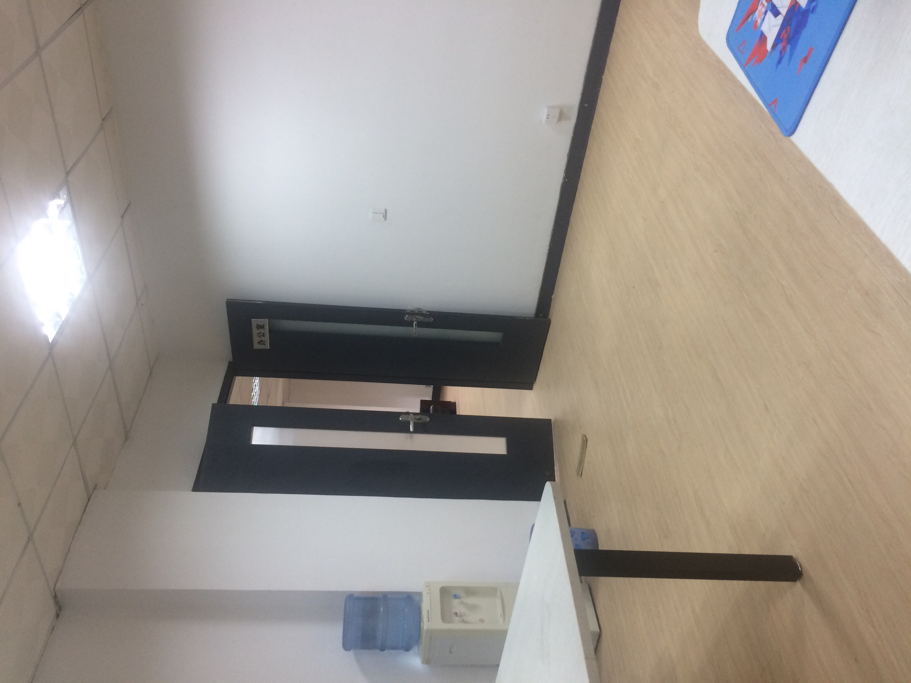
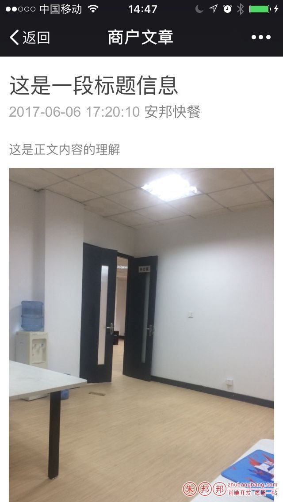

IOS垂直拍照的时候会遇到，PC端读取的时候，逆时针旋转了90度的问题；

安卓、PS处理的，相册选择截图等不会出现这个问题；

场景说明：

比如原图是：https://zhubangbang.com/ssl/demo-img/transform-origin-demo.jpg

这个图片在浏览器里，如果您单独打开的时候，是垂直显示的；

但是包裹在IMG标签内就会逆时针旋转了；



如上图；

这种情况下，因为window系统看图不支持方向自动识别，所以看到的还是正常垂直的；

在微信中，看到的也是没问题的（手机中用lrz处理过）




 

原理分析：

可以通过`exif-js`这个插件来获取图片信息；

GitHub地址：`https://github.com/exif-js/exif-js`

API文档：`http://code.ciaoca.com/javascript/exif-js/`

```javascript
$fileImg.load(function(){
    // console.log("加载完成！");
    var Orientation;
    EXIF.getData($fileImg[0], function() {
        Orientation = EXIF.getTag(this, "Orientation");
        console.log("拍照Orientation值是：",Orientation);
        if(Orientation===6){//
            // console.log("这张图片是IOS垂直拍的");
            //image-orientation: from-image
            $fileImg.css({"image-orientation":"from-image"});
        }
    });
    
});
```
注意`“Orientation”`这个属性，IOS垂直拍出来的照片，`Orientation`是6；安卓手机拍出来是1；PS截图等处理后的照片会自动舍弃该属性，如果您获取的话，会是`undefined`；

可以通过CSS来解决；

比如火狐浏览器有一个新属性的：`image-orientation` ；

可通过CanIuse来看兼容性：`http://caniuse.com/#feat=css-image-orientation`

可以通过设置：`image-orientation: from-image;`这个属性让图片正常显示；

但是Chrome等浏览器并不支持；

Mozilla官网的介绍：`https://developer.mozilla.org/zh-CN/docs/Web/CSS/image-orientation`

网上了下，也有类似的问题：`https://stackoverflow.com/questions/24658365/img-tag-displays-wrong-orientation`

DEMO：`http://jsfiddle.net/7j5xJ/`

国内的相关文章`：http://www.jianshu.com/p/ad4501db178e`

最终我的处理方式
```javascript
$fileImg.load(function(){
    // console.log("加载完成！");
    var Orientation;
    EXIF.getData($fileImg[0], function() {
        Orientation = EXIF.getTag(this, "Orientation");
        // console.log("拍照Orientation值是：",Orientation);
        if(Orientation===6){
            // console.log("这张图片是IOS垂直拍的");
            //image-orientation: from-image;
            // $fileImg.css({"image-orientation":"from-image"});
            $fileImg.css({
                "transform":"rotate(90deg)",
                "transform-origin":"0 0",
                "marginLeft":"270px",
                "paddingBottom":"80px",
                "height":"auto",
                "width":"360px"
            });
        }
    });
    
});
```
因为`image-orientation` 这个属性就火狐和`safari`支持，主流`chrome`也不支持，所以就彻底不用这个属性；

通过变换角度并想右移动图片的HTML中高度；

因为上面和下面可能会有文字，所以通过`padding-bottom`微调下；

注意这种情况下，不能设置`max-width` 这个属性；

PC中看到的如下图


