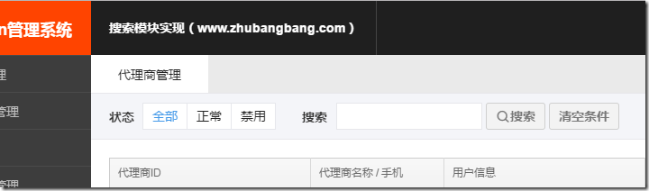

解决问题：简化页面中的搜索功能的代码实现；

应用场景：很多模块，大多数的搜索逻辑都是差不多的 ；比如输入框搜索、按照月份搜索，按照Selected/tab筛选；搜索在浏览器上的表现是，用户按照单个或多个条件搜索，回车，或者点击搜索按钮可以进行数据的筛选（通过URL中带参数的形式）

可能存在的页面如下；



设置的使用的方法：

```
配置好参数，就可以直接用了；
假如开发者配置的时候，某些参数配置，不小心配置错了；console 提醒下，哪个属性配置错了，导致了什么问题；
```

首先需要一个config页面；为了避免和别的模块发生冲突；我起名了searchConfig；

模块的配置如下；

URL可能在两种，一种是直接某某下面的页面、也可能是某某下面页面，搜索的某个ID下，在这个页面内的搜索；比如某某代理商的某页面下，参数中可能会存在 xxx?id=111 这种情况；

```javascript
var searchConfig={
    "url"       :"/orchard/distributors",//跳转的URL  如/orchard/distributors  或 /orchard/distributors?id=111111
    "searchBtn" :"#search", //触发 搜索   的按钮
    "resetBtn"  :"#reset",  //触发 初始化 的按钮
    "data":[
        {
            "key"       :"merchant_id",
            "type"      :"input",//input/tab/month/checkbox
            "location"  :"#keyword"
        },
        {
            "key"       :"status",
            "type"      :"tab",//input/tab/month/checkbox
            "location"  :"#card_status"
        },
        {
            "key"       :"is_good",
            "type"      :"checkbox",//input/tab/month/checkbox
            "location"  :"#is_good_store"
        },
        {
            "key"       :"month",
            "type"      :"month",//input/tab/month/checkbox
            "location"  :"#month-picker",
            "form"      :"2016-11"
        }
    ]
};
```
封装好的代码的结构如下：


开发者配置出错时候，如下；


代码如下：
```javascript
define(function(require,exports,module){
    "require:nomunge,exports:nomunge,module:nomunge";
    /*********************searchConfig的说明和格式DEMO******************/
    /*
    * 变量 searchConfig 是页面中配置的；
    *
    * data.key 说明   [*必须]
    *   内容：如果是"merchant_id"，则跳转的url里是 "merchant_id=xxxxxx"这种格式；
    *
    * data.type 说明  [*必须]
    *   内容:input/tab/month/day/select/checkbox
    *       input   ：比如用户的ID搜索
    *       tab     ：比如状态的筛选（全部/正常/禁用）
    *       month   ：月份的筛选
    *       checkbox：筛选的checkbox
    *
    * data.location 说明  [*必须]
    *   格式："#keyword"或".class-name" 其中"#"代表id名；"."代表是class名;(推荐使用ID，如果使用class，请保证当前页面class唯一)
    *       如果是input类型  ，写input的id/class;
    *       如果是tab类型    ，请写"filter-select"上面的的id/class;
    *       如果是month类型  ，请写隐藏input的ID,一般是 "#month-picker" ;
    *       如果是checkbox类型，请写当前input标签上的id/class;
    *
    * data.form [非必须]
    *   格式：如果是month类型，通过这个参数 可以限制的最小开始月份,默认从"2017-06"开始
    *
    * 如果是用 month 这个类型，需要在页面引入下面这个样式；
    <link href="http://a.f265.com//module/month-picker/css/month-picker.css" rel="stylesheet" type="text/css">
    *
    * 如果用data 这个类型，需要在页面引入下面这个样式；
    <link href="http://a.f265.com/module/daterangepicker/css/daterangepicker.css" rel="stylesheet" type="text/css" />
    * */
    
    //TODO:演示DEMO；
    /*
        var searchConfig={
            "url"       :"/orchard/distributors",//跳转的URL  如/orchard/distributors  或 /orchard/distributors?id=111111
            "searchBtn" :"#search", //触发 搜索   的按钮
            "resetBtn"  :"#reset",  //触发 初始化 的按钮
            "data":[
                {
                    "key"       :"merchant_id",
                    "type"      :"input",//input/tab/month/checkbox/date
                    "location"  :"#keyword"
                },
                {
                    "key"       :"status",
                    "type"      :"tab",//input/tab/month/checkbox/date
                    "location"  :"#card_status"
                },
                {
                    "key"       :"is_good",
                    "type"      :"checkbox",//input/tab/month/checkbox/date
                    "location"  :"#is_good_store"
                },
                {
                    "key"       :"month",
                    "type"      :"month",//input/tab/month/checkbox/date
                    "location"  :"#month-picker",
                    "form"      :"2016-11"
                },
                {
                    "key"       :"start_date",
                    "type"      :"date",//input/tab/month/checkbox/date
                    "location"  :"#custom-date"//开始日期就是这个input的value值；
                }
            ]
        };
    
    */
    
    /******************************正文开始*******************************/
    
    var MonthPicker,Daterangepicker;
    var $body=$("#bodyer");
    var pageSearch={};
    
    //计算搜索的默认值
    function computerDefaultVal($el,type) {
        switch(type) {
            case "input":
                return $el.val();
            case "tab":
                return $el.find("li").filter(".active").find("a").data("state");
            case "month":
                return $el.val();
                break;
            case "date":
                return $el.val();
                break;
            case "checkbox":
                return $el.is(":checked") ? 1 : 0 ;
            default:
                console.info("searchConfig中有非法的type："+type+"，请检查是否拼写错误。对应元素是",$el[0]);
                return "this_value_is_undefined";
        }
    }
    //根据类型，生成不同的事件；
    function creatEventBaseType(tempItem) {
        switch(tempItem.type) {
            case "input":
                return function () {
                    $body.on("keypress",tempItem.location,function(e){
                        e = e || window.event;
                        if (e.keyCode==13){
                            tempItem.varName = $(this).val();
                            pageSearch.searchModule()
                        }
                    });
                    $body.on("blur",tempItem.location,function(e){
                        tempItem.varName = $(this).val();
                    });
                };
            case "tab":
                return function () {
                    $body.on("click",tempItem.location+" .filter-item",function(e){
                        e.preventDefault();
                        tempItem.varName=$(this).find("a").data("state");
                        pageSearch.searchModule();
                    });
                };
            case "month":
                return function () {
                    MonthPicker = require("month-picker");
                    var monthPicker = new MonthPicker({
                        el: tempItem.location,
                        from: tempItem.form||"2017-06",
                        to: true,
                        onSelect: function () {
                            tempItem.varName = this.value;
                            pageSearch.searchModule();
                        }
                    });
                };
            case "date":
                return function () {
                    Daterangepicker = require("daterangepicker");
                    var isSingle=true;
                    var daterange = new Daterangepicker(tempItem.location, {
                        "autoUpdateInput": false,
                        singleDatePicker: isSingle,
                        showDropdowns: true,
                        "locale": {
                            "format": 'YYYY-MM-DD',
                            "customRangeLabel": "Custom",
                            "firstDay": 0
                        }
                    }, function (start, end, label) {
                        var starDate=start.format('YYYY-MM-DD');
                        // var endDate=end.format('YYYY-MM-DD');
                        // this.element.val(starDate + " 至 " + endDate);
                        this.element.val(starDate);
                        tempItem.varName = starDate;
                        pageSearch.searchModule();
                    });
                };
            case "checkbox":
                return function () {
                    $body.on("change",tempItem.location,function(e){
                        tempItem.varName=$(this).is(":checked") ? 1 : 0 ;
                        pageSearch.searchModule();
                    });
                };
            default:
                return function () {
                    console.warn("searchConfig中有非法的type:"+tempItem.type+" 导致了匹配事件失败");
                };
        }
    }
    
    pageSearch.init=function () {
        this.search();
    };
    pageSearch.search=function () {
        var self=this;
        //触发搜索
        if(searchConfig.searchBtn){
            $body.on("click",searchConfig.searchBtn,function(e){
                e.preventDefault();
                self.searchModule();
            });
        }
        //reset
        if(searchConfig.resetBtn){
            $body.on("click", searchConfig.resetBtn, function () {
                window.location.href = searchConfig.url;
            });
        }
    };
    pageSearch.searchModule=function(){
        var tempSearchStr="";
        $.each(searchConfig.data,function (index, val) {
            var $this=$(this);
            var modifier;
            //如果url为/orchard/distributors?distributor_id=688189193821626368 这种详情内的搜索；符号全为&;
            if(searchConfig.url.indexOf("?") > 0){
                modifier="&";
            }else{
                modifier=(index==0)?"?":"&";
            }
            tempSearchStr+=modifier+$this[0].key+"="+$this[0].varName;
        });
        window.location.href = searchConfig.url + tempSearchStr;
    };
    
    //赋值默认的搜索数据；
    var searchLen=searchConfig.data.length;
    for (var i=0;i<searchLen;i++){
        var tempItem=searchConfig.data[i];
        if(!tempItem.key){
            console.error("页面上searchConfig 配置出错，有一个元素没有配置key，位置是searchConfig.data的第 "+i +" 项。");
            return;
        }
        tempItem.varName=computerDefaultVal($body.find(tempItem.location),tempItem.type);//默认值储存在对象的varName中；
        //生成事件
        pageSearch["creatEvent_"+tempItem.key]=creatEventBaseType(tempItem);
        pageSearch["creatEvent_"+tempItem.key]();//类似pageSearch.init()的功能
    }
    pageSearch.init();
});
```