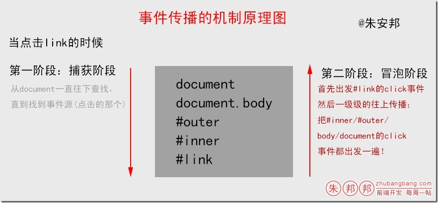

事件传播机制（不管是DOM0还是DOM2，这个机制是天生就带的）；当触发底层元素的某一个事件行为，那么它的上级元素的对应事件行为也会一级级的触发，一直出发到我们的document；（只有相同的事件类型才会触发）


从底层一级级网上传播的机制叫做冒泡；

DOM2级绑定事件，第三个参数写false代表的是冒泡阶段执行，如果写的是true，代表的是在捕获阶段执行；

同一个元素既可以在捕获阶段处理也可以在冒泡阶段处理；

DOM0级基本上只能控制冒泡阶段，而DOM2级是可以控制捕获阶段的；

事件委托：利用DOM的传播机制（点击任意元素，document的click都要出发），我们给document绑定一个点击事件，在事件中我们只需要获取事件源；根据不同的事件源做不同的事件就可以的了（这样就可以不用给元素一个个的绑定事件的了）；

·演示部分

HTML+CSS部分
``` 
<head>
    <meta charset="UTF-8">
    <title></title>
    <style type="text/css">
        body, div, a {
            margin: 0;
            padding: 0;
            font-family: "微软雅黑";
            font-size: 14px;
            -webkit-user-select: none;
        }
        #outer {
            margin: 10px auto;
            width: 300px;
            height: 300px;
            background: #faeb9e;
            cursor: pointer;
        }
        #inner {
            margin: 10px auto;
            width: 200px;
            height: 200px;
            background: #37C7D4;
            cursor: pointer;
        }
        #link {
            display: block;
            width: 100px;
            height: 30px;
            line-height: 30px;
            background: #B00000;
            cursor: pointer;
        }
    </style>
</head>
<body>
<div id="outer">
    <div id="inner">
        <a id="link">Test</a>
    </div>
</div>
```
·javascript部分
```
<script type="text/javascript">
    var outer = document.getElementById("outer");
    var inner = document.getElementById("inner");
    var link = document.getElementById("link");
    function fn() {
        console.log(this.id || this.nodeName);
        //有id输出id值，没有的话输出nodeName
    }
    link.addEventListener("click", fn, false);
    inner.addEventListener("click", fn, false);
    outer.addEventListener("click", fn, false);
    document.body.addEventListener("click", fn, false);
    document.body.addEventListener("click", fn, true);//先执行这个，因为捕获阶段的
    document.addEventListener("click", fn, false);
</script>
```
输出结果是：
```
BODY：这个是捕获阶段就执行的；
link
inner
outer
BODY
#document
```
原理图分析如下：



