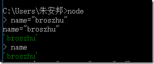
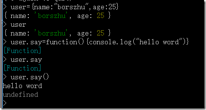
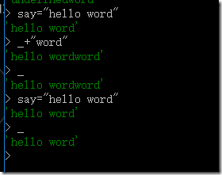
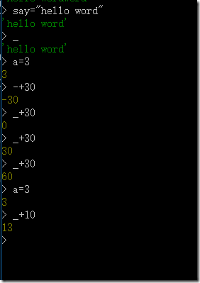
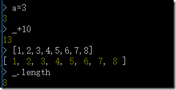
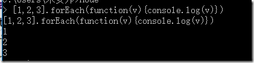
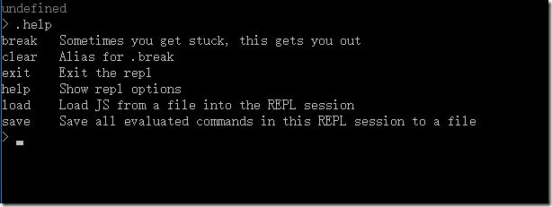

类似浏览器的控制台功能；






可以用下划线，引用上次操作的值；





可用数组的length的属性来获取数组的；



还可以掉用函数



还可以开启一个服务器；

；如果需要了解命令，可以用.help来查看



语法:输入node命令，然后写下面
```
.save 保存一个文件夹
.save reademe.md 就可以新建一个reademe.md的文件；
```
然后在下面输入11+11 就可以在里面写入数据了；
```
.load 执行保存过的文件夹
.load reademe.md 可以执行11+11 返回22 
```
通过.help查看