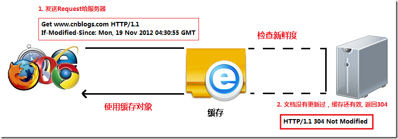
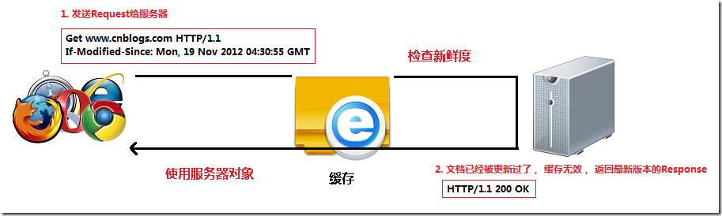
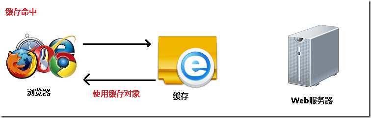

### 缓存
http协议提供了非常强大的缓存机制， 了解这些缓存机制，对提高网站的性能非常有帮助。 本文介绍浏览器和web服务器之间如何处理”浏览器缓存”，以及控制缓存的http header.

### 缓存的好处
- 减少了冗余的数据传输，节省了网费。
- 减少了服务器的负担， 大大提高了网站的性能
- 加快了客户端加载网页的速度
- 如何判断缓存新鲜度
- web服务器通过2种方式来判断浏览器缓存是否是最新的。

第一种， 浏览器把缓存文件的最后修改时间通过 header ”if-modified-since“来告诉web服务器。

第二种， 浏览器把缓存文件的etag, 通过header “if-none-match”, 来告诉web服务器。

通过最后修改时间, 来判断缓存新鲜度
- 浏览器客户端想请求一个文档， 首先检查本地缓存，发现存在这个文档的缓存， 获取缓存中文档的最后修改时间，通过： if-modified-since， 发送request给web服务器。
- web服务器收到request，将服务器的文档修改时间（last-modified）: 跟request header 中的，if-modified-since相比较， 如果时间是一样的， 说明缓存还是最新的， web服务器将发送304 not modified给浏览器客户端， 告诉客户端直接使用缓存里的版本。如下图。

假如该文档已经被更新了。web服务器将发送该文档的最新版本给浏览器客户端， 如下图。

### 与缓存有关的header

request

- cache-control: max-age=0 以秒为单位
- if-modified-since: mon, 19 nov 2012 08:38:01 gmt 缓存文件的最后修改时间。
- if-none-match: “0693f67a67cc1:0” 缓存文件的etag值
- cache-control: no-cache 不使用缓存
- pragma: no-cache 不使用缓存

response

- cache-control: public 响应被缓存，并且在多用户间共享， （公有缓存和私有缓存的区别，请看另一节）
- cache-control: private 响应只能作为私有缓存，不能在用户之间共享
- cache-control:no-cache 提醒浏览器要从服务器提取文档进行验证
- cache-control:no-store 绝对禁止缓存（用于机密，敏感文件）
- cache-control: max-age=60 60秒之后缓存过期（相对时间）
- date: mon, 19 nov 2012 08:39:00 gmt 当前response发送的时间
- expires: mon, 19 nov 2012 08:40:01 gmt 缓存过期的时间（绝对时间）
- last-modified: mon, 19 nov 2012 08:38:01 gmt 服务器端文件的最后修改时间
- etag: “20b1add7ec1cd1:0” 服务器端文件的etag值

如果同时存在cache-control和expires怎么办呢？ 浏览器总是优先使用cache-control，如果没有cache-control才考虑expires

##### etag
etag是实体标签（entity tag）的缩写， 根据实体内容生成的一段hash字符串（类似于md5或者sha1之后的结果），可以标识资源的状态。 当资源发送改变时，etag也随之发生变化。

etag是web服务端产生的，然后发给浏览器客户端。浏览器客户端是不用关心etag是如何产生的。

为什么使用etag呢？ 主要是为了解决last-modified 无法解决的一些问题。

- 某些服务器不能精确得到文件的最后修改时间， 这样就无法通过最后修改时间来判断文件是否更新了。
- 某些文件的修改非常频繁，在秒以下的时间内进行修改. last-modified只能精确到秒。
- 一些文件的最后修改时间改变了，但是内容并未改变。 我们不希望客户端认为这个文件修改了。
### 浏览器不使用缓存
ctrl+f5强制刷新浏览器，或者设置ie。 可以让浏览器不使用缓存。

- 浏览器发送http request, 给web 服务器， header中带有cache-control: no-cache. 明确告诉web服务器，客户端不使用缓存。
- web服务器将把最新的文档发送给浏览器客户端.

pragma: no-cache的作用和cache-control: no-cache一模一样。 都是不使用缓存。

pragma: no-cache 是http 1.0中定义的， 所以为了兼容http 1.0. 所以会同时使用pragma: no-cache和cache-control: no-cache

##### 直接使用缓存，不去服务器验证
按f5刷新浏览器和在地址栏里输入网址然后回车。 这两个行为是不一样的。

按f5刷新浏览器， 浏览器会去web服务器验证缓存。

如果是在地址栏输入网址然后回车，浏览器会”直接使用有效的缓存”, 而不会发http request 去服务器验证缓存，这种情况叫做缓存命中，如下图

