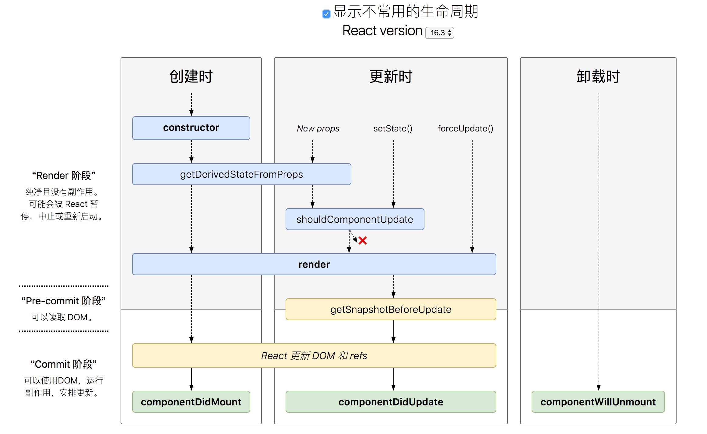
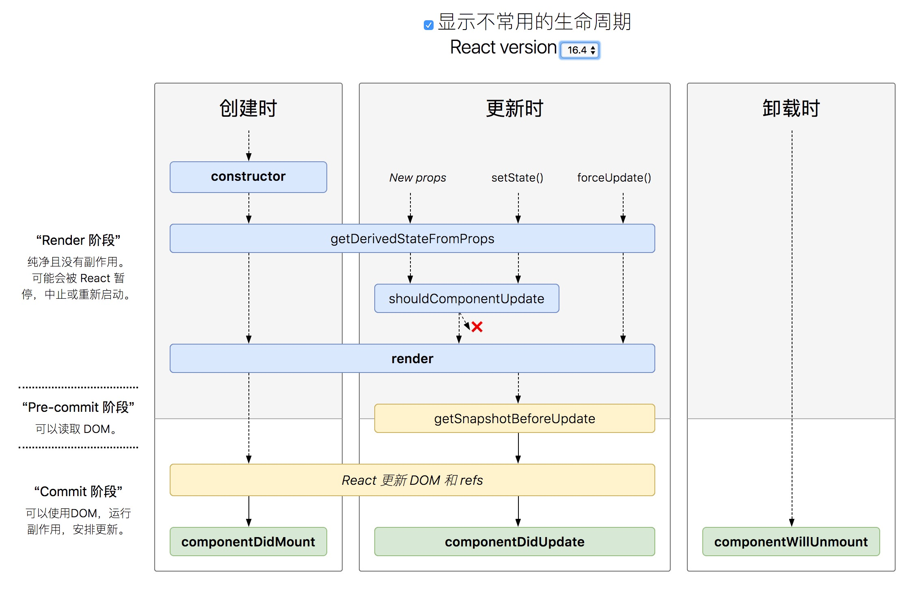
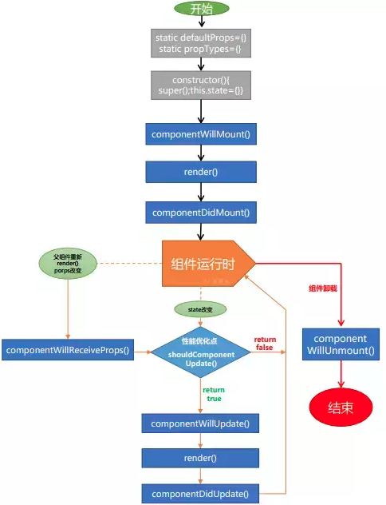

16.3版本以前和以后生命周期是不同的；

Before React 16.3，下面这个图参考下就可以

After React 16.3，一个比较直观的图

官网上的图，供参考

-------

生命周期不同阶段
- constructor
- getDerivedStateFromProps
- componentDidMount
- componentWillUnmount
- getSnapshotBeforeUpdate
- componentDidUpdate
- shouldComponentUpdate

## constructor
- 用于初始化内部状态，很少使用
- 唯一可以直接修改state的地方，以后都是setState修改了

## getDerivedStateFromProps
- 当state需要从props初始化时时候
- 进来不要使用:维护两者状态一致性会增加复杂度
- 每次render都会调用的
- 典型场景：表单控件获取默认值（初始值是props指定，而后就是用户输入的值了）

基本上除了表单获取默认值的场景下，别的场景用不到

## componentDidMount
- UI渲染完成后调用，这个方法非常常用
- 只执行一次
- 典型场景：获取外部资源（发AJAX事情）

## componentWillUnmount
- 组件移除时被调用
- 典型场景：资源释放

## getSnapshotBeforeUpdate
- 在页面render之前调用，state已更新
- 典型场景：获取render之前的DOM状态（思考为什么要获取?）

比如交易所，最新交易记录，可以滚动的，如果滚动到某一个位置，由于上方一直插入，滚动条会一直动，不能定位某条数据；

用 `getSnapshotBeforeUpdate` 可以获取之前高度，和现在高度的差值，然后差值加`scrollTop`，这样就可以定位某条数据了；

## componentDidUpdate
- 每次UI更新时被调用
- 典型场景：页面需要根据Props变化重新获取数据（比如文章的内容是根据URL的ID来获取的，当用户改变ID时候，根据新ID渲染对应内容）

## shouldComponentUpdate
- 决定Virtual DOM是否需要重绘（是否重绘，决定是否进行render）
- 典型场景：性能优化
- 一般不需要自己实现，由 PureComponent 自动实现，可以判断当前props/state和之前的值是否有变化，如果没变化，会自动阻止的；