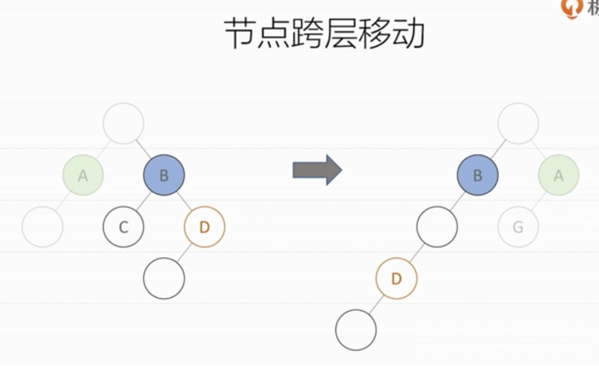

Virtual DOM 的工作原理，理解Key属性的作用

> Virtual DOM 是JSX的运行基础；

- 算法复杂度为O（n）
- 虚拟DOM如何计算Diff
- key属性的作用

# 算法复杂度为O的n次方

DOM Tree前后变化的Diff辨别，复杂度非常高的，复杂度为O的n次方；

# 虚拟DOM如何计算Diff

React是下面这样处理的；

- 广度优先分层比较（按照组件树，一层一层的做对比）
- 从根节点开始比较（第一层：组件的根）
- 属性变化及顺序（第二层：组件A+B改为B+A了）
- 节点类型发生变化（第三层：开始组件A后跟F；现在改为组件A后跟G，就直接删除F，push组件G）
- 节点跨层移动（第三层：B后跟CD，变成了B后跟X，会直接删除CD以及CD下面的组件，push组件X）
    - 第四层D跟在X后面，直接把Dpush到X；

### 虚拟DOM算法工作的两个假设

- 组件的DOM结构是相对稳定的，很少发生跨层移动的（尽量不要跨层移动）
- 类型相同的兄弟节点可以被唯一标示（我们需要手动传入一个固定的Key，尽量不用index,length这种可变的值做key）

#  key属性的作用

因为虚拟DOM算法的工作假设，所以需要传入key；传入key不仅仅是消除warning，是因为要配合DIff算法，提高性能；