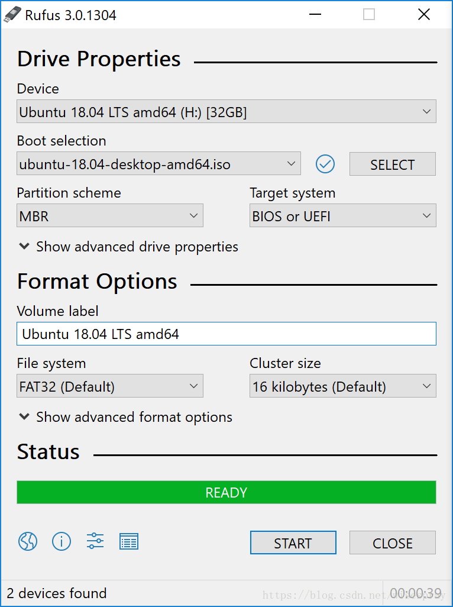

### 一、下载Ubuntu18.04系统的iso文件 

https://cn.ubuntu.com/desktop/

下载后的文件：ubuntu-18.04.1-desktop-amd64.iso

### 二、制作U盘启动系统 

下载软件： [Rufus](https://rufus.akeo.ie) 

file is on `./bin/rufus-3.3.exe`

插入U盘后，直接双击下载的fufus.exe(绿色免安装)启动， 

按照如图设置后，软件会把ubuntu-18.04.1-desktop-amd64.iso文件，写入U盘，制作系统启动盘。

