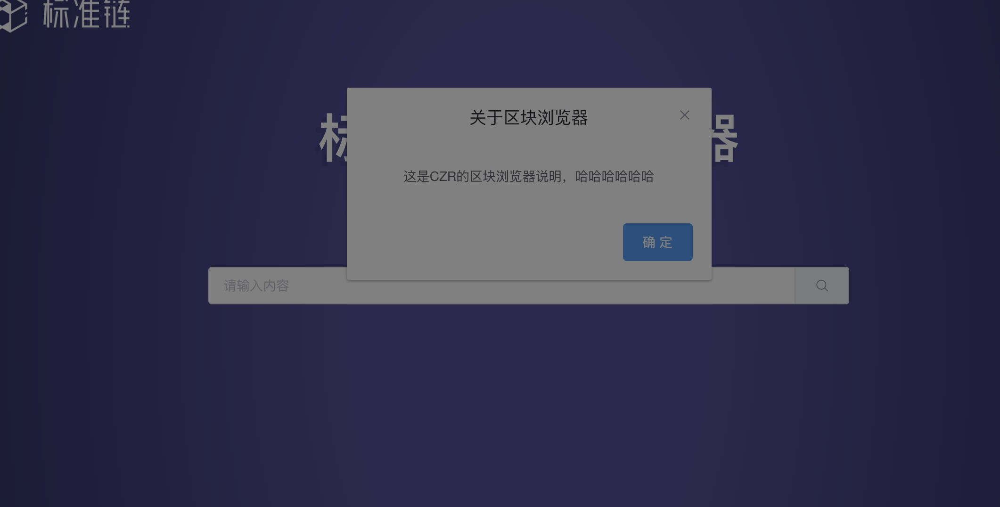
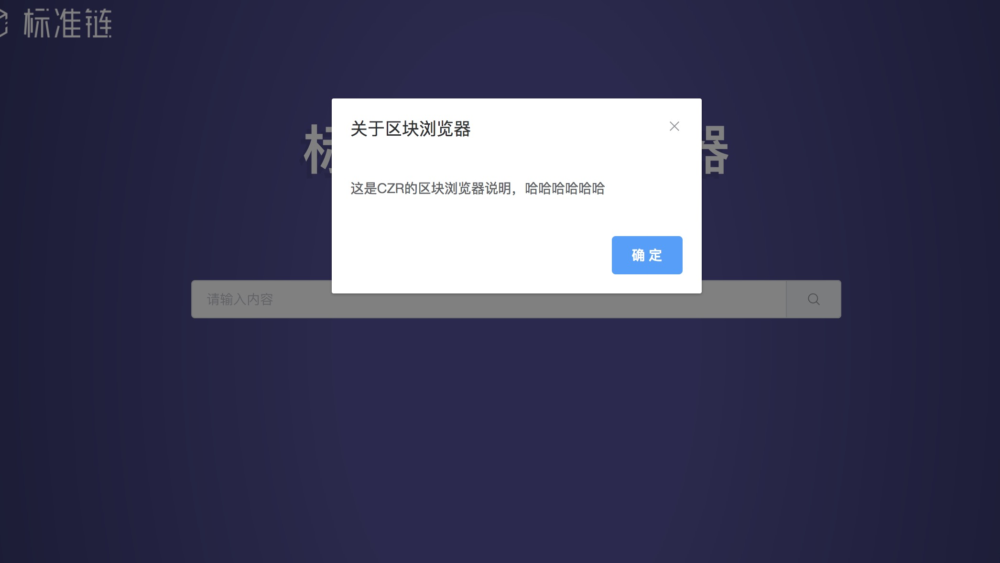

#element ui 弹出组件的遮罩层在弹出层的上面




解决办法是在el-dialog这一级加上

`:append-to-body=”true”`

即可，让他append到body；

如下图



导致原因是我

```css
.xxx{
    width: 100%; 
    height: 100%;
    position: fixed; 
    top: 0;left: 0; 
    text-align: center;
}
```

这些属性导致的；

导致这种表现的会有很多，可以通过调index，去掉遮罩等多种方式解决