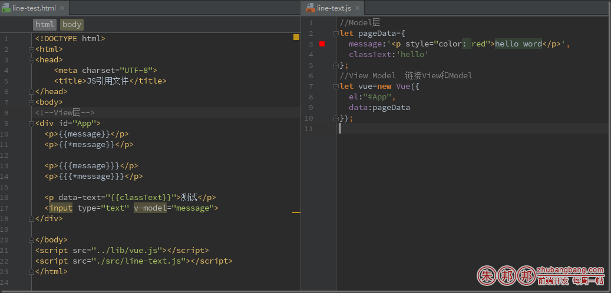

VUE是View-Model-viewModel

其中viewModel起到粘合剂的作用，连接view层和Model层；

HTML代码是view层的表现；Model是数据的集合；

可以通过v-model在input等表单输入标签上，实现数据的双向绑定；

数据绑定就是将数据和视图相关联，互相影响，修改其中任一数据，都会立即体现到另外一层；

输出hello word


首先介绍的一段话的渲染

```
{{message}}  以文本的方式渲染出来；

{{{message}}}   把message以HTML的方式渲染出来;注意写三个大括号的时候不要写成{{{}}这个了，webStorm2016亲测不能正常补全；
```

这么写和angular一样有个确定FOUCS的现象，就是没有加载数据的时候，此时的模版没有被替换，直接显示出{{messagr}}这样的输出，非常不利于体验；如果你仅仅是输出一段话，那么推荐你可以用下面这种的写法；

```
v-text=”message”

v-html=”message”
```

这样的写法；

写在大括号里的这种写法也叫插值，v-*这种的写在在vue里叫做指令；





{{}}插值的其他用法

1、支持忽略同步

2、支持作为自定义属性输出

3、支持表达式（注意是表达式，不是语句；三目运算符是表达式，if语句是属于语句，不属于运算符）

4、支持过滤器；

### 一、支持忽略同步；

如果你仅仅只是想输出数据的初始值，那么并不推荐你这么做，推荐你下面这种的写法

`{{*messagr}} 这种渲染的时候，就只会渲染你第一次的值，后面修改并不会改变了；{{{*}}} 这也是同样的用法；`

### 二、支持作为自定义属性输出

下面这种的用法也可以输出类名，ID之类的

`<p data-text="{{classText}}">测试</p>`

### 三、支持表达式的写法

``` 
注意一：if 是属于语句，不属于表达式；
注意二：如果用三木运算符，请写完整，否则容易出问题；
```


### 四、支持过滤器；

注意有些教程的转换大写用的是toUpperCase，这个方法是错误的，正确的是uppercase;版本V2.0+’