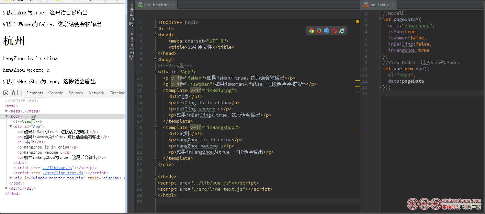
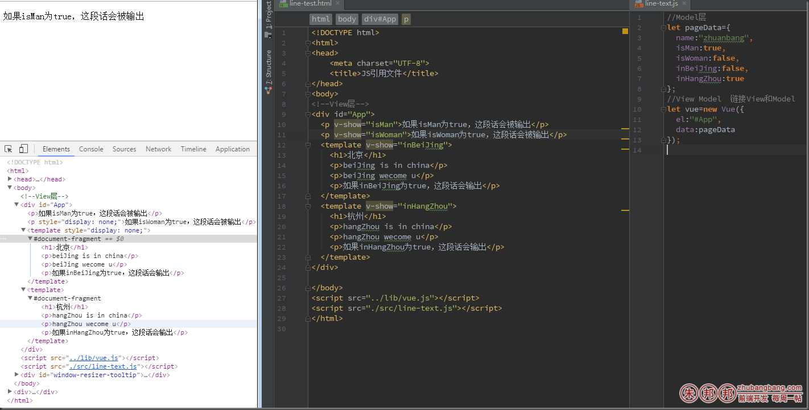
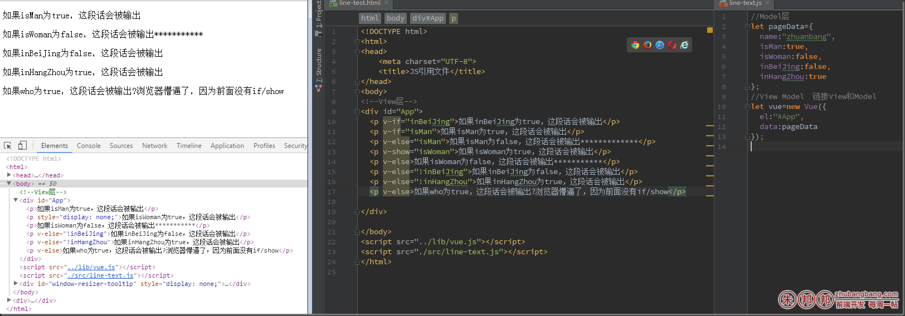
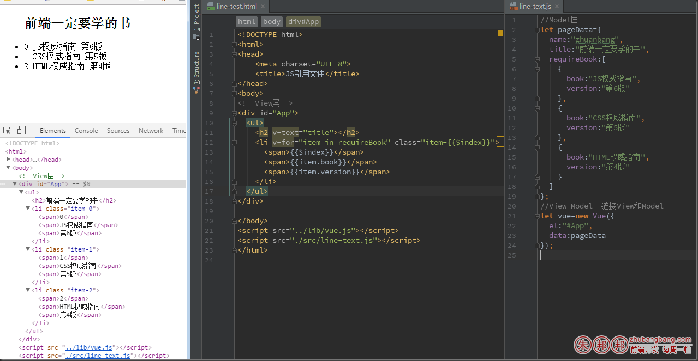
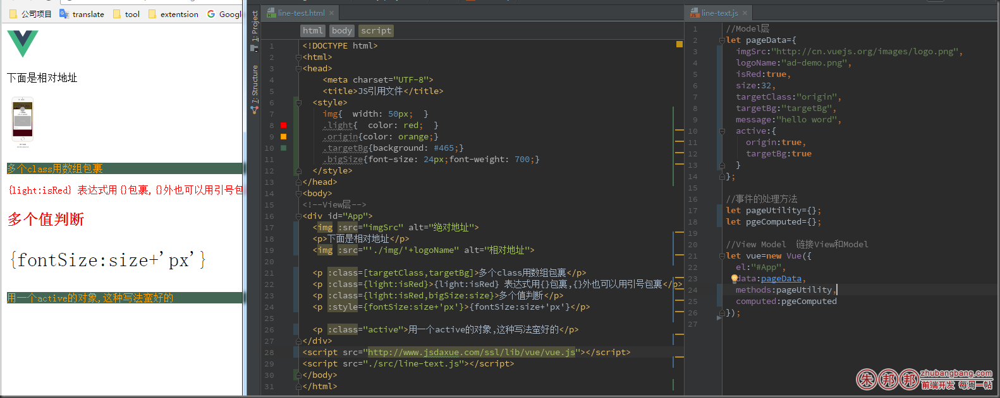

VUEJS属于MVVM模式，是封一个组件，然后根据场景使用不同的组件；

VUE中分为三个结构；
``` 
M- model –>数据

V- view  ->HTML

VM- viewModel   ->HTML和数据之间的管道，起到粘合剂的作用；
```


而渲染view层的HTML，就需要了解指令，如果你以前接触过angular，那么你可以非常容易的上手他，因为你会发现和angular的指令原理差不多的；

#### 为了方便记忆，把指令为几种形式；

### 一、页面渲染指令
``` 
v-text

v-html

v-if

v-show

v-else

v-for

v-bind (简写为:)
``` 
### 二、事件绑定指令

``` 
v-on(简写为@)
``` 

### 三、动态修改双向值指令
``` 
v-model
``` 

# 一、页面渲染指令详解；

v-text

这个指令可以更新元素的textContent，{{}}插值也被编译为textNode的一个v-text指令；两者相似，可以看作等价的；

v-html

这个指令可以更新元素的htmlContent,等价于{{{}}}这种的写法；v-text和v-html在vue初识的时候已经了解了，就不再附属

v-if

这个指令可以完全根据表达式的值在DOM中生成或者不生成一个元素/元素块；

原理：

表达式值为true，对应元素的clone值会被重新插入到DOM中（FOCUS）；

表达式值为false，对应的元素在DOM中s输出后再删除；

为了更好的组件化，if可以用作大段的HTML判断(template、style、script这三个标签分别包裹HTML/JS/CSS的代码)，如下；



v-if

注意：template在虚拟DOM中仅仅是一个包装元素，作为一个判断作用，我个人感觉类似代码块的{}这种的意思，在真实的DOM输出时，template这个标签并不会会被输出的；

v-show

字面理解，就是显示，这个指令就像他的名字一样，只是控制元素的display，无论里面的表达式结果为true还是false，都会渲染出来，然后再根据表达式为真还是假来切display；



亲测v-show不支持template标签，通过上面的例子可以看出，v-show是通过display来判断，上面的isMan和isWoman一个true一个为false，通过看elements，为false的有一个行内样式display为none的属性；

### v-if和v-show的区别；

```
1、if是虚拟DOM中运算后，为false值的不输出在页面，属于真实渲染，show是全部输出；亲测输出的时候，show和if都有FOCUS现象；一闪而过,哈哈懵逼了！

2、if切换的时候是真实的销毁和重建条件块内的事件监听器和子组件，代价较高，但是更彻底；show切换时候更加效率，因为他只控制了css

3、if支持template标签，show不支持template标签

4、一般show用于频繁切换的场景（因为DOM全部输出了，切换的成本低）；if用于几乎不切换的场景（因为真实渲染，渲染的更干净，不像show的页面初始输出成本高）；

```


v-else

这个指令是对if和show指令的补充，写的一个else块；



v-else

- v-else元素必须立即跟在v-if或v-show元素的后面——否则它不能被识别；
- v-else元素是否渲染在HTML中，取决于前面使用的是v-if还是v-show指令。

v-for

渲染列表等数组对象；用法如下



v-bind:

可以在其名称后面带一个参数，中间放一个冒号隔开，这个参数通常是写HTML元素的特性（attribute），图片的src等；

用法 v-bind:argument=”expression”

例如  v-bind:class=”expression ? trueValue : falseValue”

缩写为冒号

例如  :class=”expression ? trueValue : falseValue”

v-bind



渲染指令