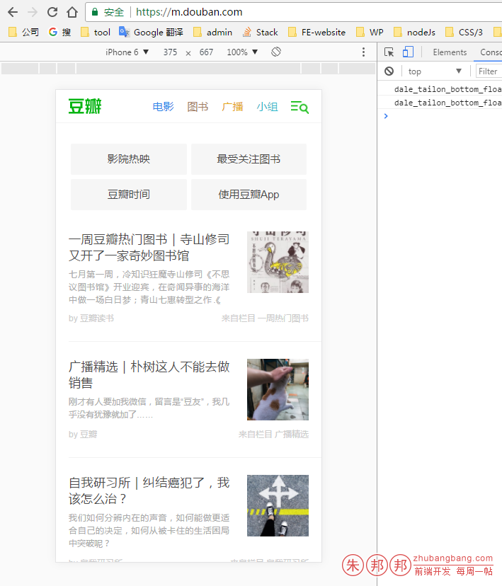
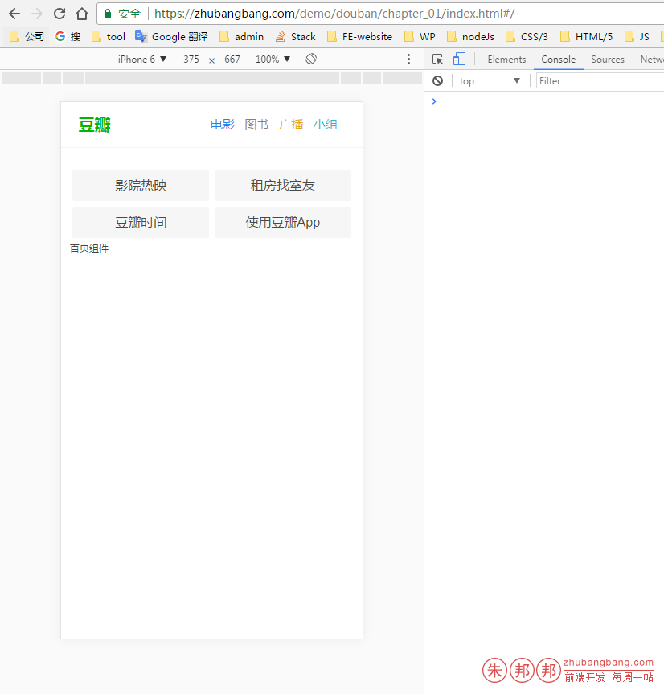
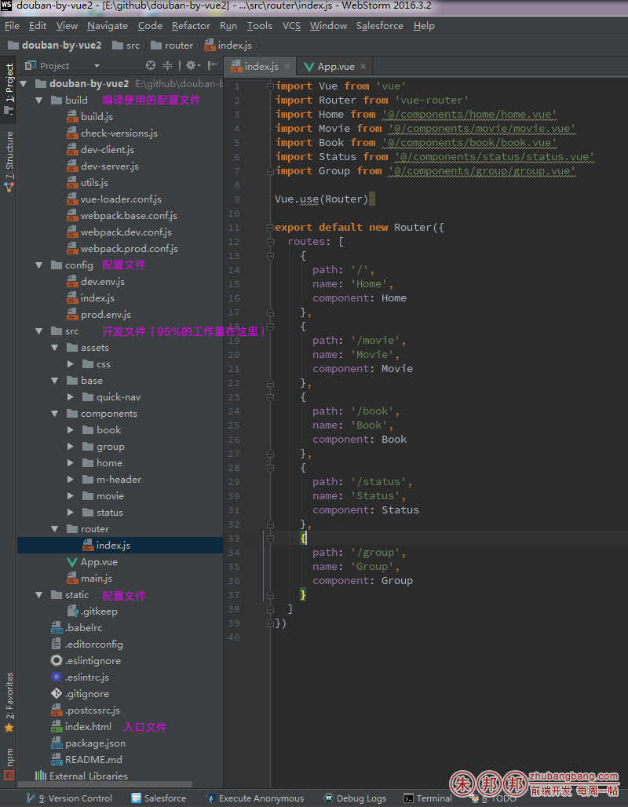
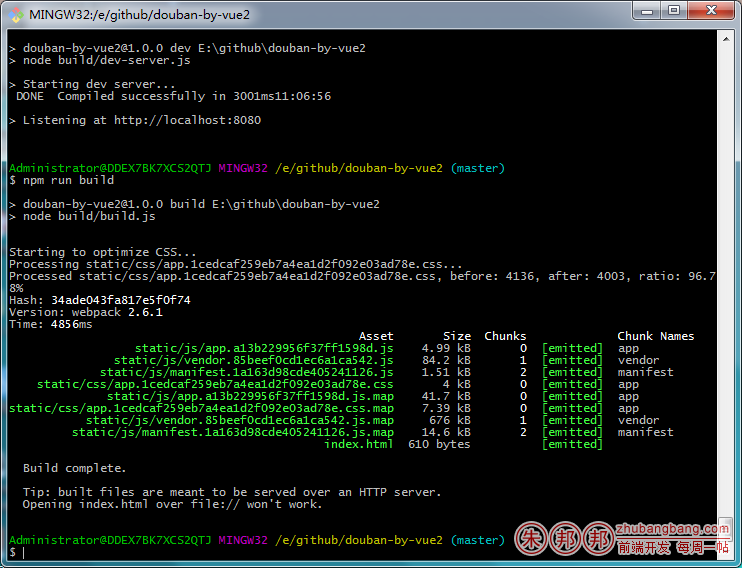
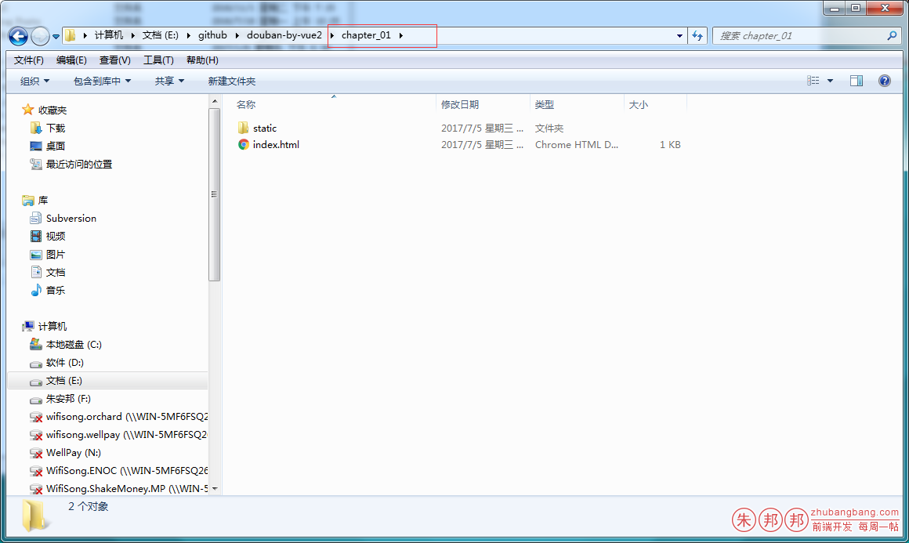

目标网站：https://m.douban.com/



本篇弄完后的效果如下；

Github地址：https://github.com/zhubangbang/douban-by-vue2

访问地址：https://zhubangbang.com/demo/douban/chapter_01/index.html#/movie




项目使用：vue-cli 这个脚手架工具完成基础配置

全局安装vue-cli

``` 
npm install –g vue-cli
```
创建你的文件夹，cd进入后

基于webpack生成项目：

``` 
vue init webpack
```
使用npm安装项目依赖包

``` 
npm install
```
启用本地开发环境的服务器（仅仅是模拟用的）

``` 
npm run dev
```
之所以可以使用dev因为脚手架工具默认帮我们配置好了，配置如下

``` 
"scripts": {
  "dev": "node build/dev-server.js",
  "start": "node build/dev-server.js",
  "build": "node build/build.js",
  "lint": "eslint --ext .js,.vue src"
},
```
除了dev外还可以使用start

``` 
npm run start
```
效果一样的；

文件作用如下




我们先开始搭建基础的骨架；

根目录下的index.html 文件如下

因为是手机端的的项目，所以要加一个‘viewport’

``` 
<meta name="viewport" content="width=device-width, user-scalable=no, initial-scale=1.0, maximum-scale=1.0, minimum-scale=1.0">
```
修改后的index文件如下：

```html
<!doctype html>
<html>
<head>
  <meta charset="UTF-8">
  <meta name="viewport"
        content="width=device-width, user-scalable=no, initial-scale=1.0, maximum-scale=1.0, minimum-scale=1.0">
  <meta http-equiv="X-UA-Compatible" content="ie=edge">
  <title>Document</title>
</head>
<body>
<div id="app"></div>
</body>
</html>
```

main.js的文件引入基础的css

``` 
import Vue from 'vue'
import App from './App'
import router from './router'
 
import '@/assets/css/index.css'
Vue.config.productionTip = false
 
/* eslint-disable no-new */
new Vue({
  el: '#app',
  router,
  render: h => h(App)
})
```

之所以使用@是因为，vue默认配置了这个快键方式，在 webpack.base.conf.js 中有如下代码段

``` 
resolve: {
  extensions: ['.js', '.vue', '.json'],
  alias: {
    '@': resolve('src')
  }
},
```
是单文件的方式引入，

``` 
import '@/assets/css/index.css'
```

index.css内的代码如下

``` 
@import "./reset.css";
@import "./iconfont.css";
```
我是在同级引入了 reset.css / reset.css

reset文件如下

```css
html { overflow: scroll; width: 100%; height: 100%; font-size: 62.5%; }
article, aside, details, figcaption, figure, footer, header, hgroup, nav, section { display: block }
html, body, dl, dt, dd, ul, ol, li, h1, h2, h3, h4, h5, h6, form, fieldset, legend, input, label, textarea, p, blockquote, th, td { margin: 0; padding: 0; -webkit-text-size-adjust: none;-moz-text-size-adjust:none; -ms-text-size-adjust: none;-o-text-size-adjust: none;text-size-adjust: none;
  -webkit-tap-highlight-color: rgba(0,0,0,0);/*鍘婚櫎楂樹寒*/ }
body, textarea { font-family: Arial; font-size: 100%; line-height: 1.5; font-weight: 400; color: #444444 }
a { text-decoration: none; color: #444444 }
a:visited {color: #444444; }
 
em, i { font-style: normal }
h1, h2, h3, h4, h5, h6, strong { font-weight: 700 }
label, input, select { vertical-align: middle }
img, button { background: transparent; border: 0 none; vertical-align: middle }
ol, ul { list-style: none }
table, th, td, fieldset, legend { font-weight: 400; border: 0 none; border-collapse: collapse }
/**{ -webkit-tap-highlight-color: rgba(0,0,0,0); -webkit-touch-callout: none }*/
input[type=text], input[type=password], input[type=file], input[type=number], input[type=email], input[type=search], input[type=tel] { vertical-align: middle; outline: 0; -webkit-appearance: none }
input::-webkit-input-placeholder, textarea::-webkit-input-placeholder {
  color:#bbb;
}
select { outline: 0; -webkit-appearance: none }
textarea { display: block; padding: 5px; font-size: 15px; border: 1px solid #d7d7d7; outline: 0; border-radius: 3px; background: -webkit-linear-gradient(#ededed 0, #fff 5%) }
body { background-color: #fff; }
```
 
iconfont是引入iconfont字体图标库
```css
@charset "UTF-8";
/* 字体文件 */
@font-face {
  font-family: 'iconfont';  /* project id 343853 */
  src: url('//at.alicdn.com/t/font_0yxx0dubj7ix80k9.eot');
  src: url('//at.alicdn.com/t/font_0yxx0dubj7ix80k9.eot?#iefix') format('embedded-opentype'),
  url('//at.alicdn.com/t/font_0yxx0dubj7ix80k9.woff') format('woff'),
  url('//at.alicdn.com/t/font_0yxx0dubj7ix80k9.ttf') format('truetype'),
  url('//at.alicdn.com/t/font_0yxx0dubj7ix80k9.svg#iconfont') format('svg');
}
 
.iconfont {
  display: inline-block;
  font-family: 'iconfont';
  font-style: normal;
  text-rendering: auto;
  -webkit-font-smoothing: antialiased;
  -moz-osx-font-smoothing: grayscale;
  -webkit-transform: translate(0, 0);
  -ms-transform: translate(0, 0);
  transform: translate(0, 0);
  -webkit-text-stroke-width: 0.02rem; }
 
.icon-lg {
  font-size: 1.6rem; }
 
.icon-2x {
  font-size: 2.4rem; }
 
.icon-3x {
  font-size: 3.2rem; }
 
.icon-4x {
  font-size: 4.8rem; }
 
.icon-5x {
  font-size: 6.4rem; }
 
.iconfont.ma-left {
  margin-left: 0.3rem; }
 
.iconfont.ma-right {
  margin-right: 0.3rem; }
 
.icon-spin {
  animation: icon-spin 2s infinite linear; }
 
.icon-pulse {
  animation: icon-spin 1s infinite steps(8); }
 
@-webkit-keyframes icon-spin {
  0% {
    transform: rotate(0deg); }
  100% {
    transform: rotate(359deg); } }
@keyframes icon-spin {
  0% {
    transform: rotate(0deg); }
  100% {
    transform: rotate(359deg); } }
.icon-rotate-90 {
  filter: progid:DXImageTransform.Microsoft.BasicImage(rotation = 1);
  transform: rotate(90deg); }
 
.icon-rotate-180 {
  filter: progid:DXImageTransform.Microsoft.BasicImage(rotation = 2);
  transform: rotate(180deg); }
 
.icon-rotate-270 {
  filter: progid:DXImageTransform.Microsoft.BasicImage(rotation = 3);
  transform: rotate(270deg); }
 
.icon-flip-horizontal {
  filter: progid:DXImageTransform.Microsoft.BasicImage(rotation=0, mirror=1);
  transform: scale(-1, 1); }
 
.icon-flip-vertical {
  filter: progid:DXImageTransform.Microsoft.BasicImage(rotation=2, mirror=1);
  transform: scale(1, -1); }
 
:root .icon-rotate-90,
:root .icon-rotate-180,
:root .icon-rotate-270,
:root .icon-flip-horizontal,
:root .icon-flip-vertical {
  filter: none; }
 
/*# sourceMappingURL=iconfont.css.map */
```

App.vue文件如下：

```vue
<template>
  <div id="app">
    <m-header></m-header>
    <router-view></router-view>
  </div>
</template>
 
<script>
  import MHeader from '@/components/m-header/m-header.vue'
 
  export default {
    name: 'app',
    components: {
      MHeader
    }
  }
</script>
 
<style>
 
</style>
```
这里引入了MHeader的文件；之所以不使用header而使用m-header作为组件名字，是因为header是原生的标签，在vue使用的时候会发生冲突；

但是使用m-header就绕过去了

``` 
<m-header></m-header>
```
m-header.vue文件如下

```vue
<template>
  <div class="header">
    <router-link to="/" tag="h1" class="header-logo">豆瓣</router-link>
    <div class="header-list">
      <router-link to="/movie"  class="list-item" tag="div"><span class="tab-link" style="color: #2384E8;">电影</span></router-link>
      <router-link to="/book"   class="list-item" tag="div"><span class="tab-link" style="color: #9F7860;">图书</span></router-link>
      <router-link to="/status" class="list-item" tag="div"><span class="tab-link" style="color: #E4A813;">广播</span></router-link>
      <router-link to="/group"  class="list-item" tag="div"><span class="tab-link" style="color: #2AB8CC;">小组</span></router-link>
    </div>
  </div>
</template>
<script>
 
</script>
<style scoped>
  .header{
    display: flex;
    border-bottom: 1px solid #f3f3f3;
    background: #fff;
    justify-content: space-between;
    padding: 0 1.8rem;
    height: 4.7rem;
    line-height: 4.7rem;
  }
  .header .header-logo{
    color: #00b600;
  }
  .header-list{
    vertical-align: middle;
  }
  .header-list .list-item{
    display: inline-block;
    font-size: 1.5rem;
    margin-right: 0.8rem;
  }
</style>
```

router/index.js 这个路由下面的文件 如下；
```js
import Vue from 'vue'
import Router from 'vue-router'
import Home from '@/components/home/home.vue'
import Movie from '@/components/movie/movie.vue'
import Book from '@/components/book/book.vue'
import Status from '@/components/status/status.vue'
import Group from '@/components/group/group.vue'
 
Vue.use(Router)
export default new Router({
  routes: [
    {
      path: '/',
      name: 'Home',
      component: Home
    },
    {
      path: '/movie',
      name: 'Movie',
      component: Movie
    },
    {
      path: '/book',
      name: 'Book',
      component: Book
    },
    {
      path: '/status',
      name: 'Status',
      component: Status
    },
    {
      path: '/group',
      name: 'Group',
      component: Group
    }
  ]
})
```

其中组件 Movie Book Group等组件内，只要能跑就可以了，目前只是弄骨架的；

如下面的
```vue
 <template>
   <div>
     小组组件
   </div>
 </template>
  
 <script>
  
   export default {}
 </script>
  
 <style>
  
 </style>
```

components 是业务组件；我们还需要一个基础组件的目录(base)

home.vue 内的文件 如下

```vue
<template>
  <div class="card">
    <quick-nav></quick-nav>
    首页组件
  </div>
</template>
 
<script>
  import QuickNav from '@/base/quick-nav/quick-nav.vue'
  export default {
    components: {
      QuickNav
    }
  }
</script>
 
<style scoped>
  .card{
    margin: 0 0.9rem;
  }
</style>
```
这里引入了一个”快速导航”的基础组件

quick-nav.vue的文件 如下

```vue
<template>
  <ul class="quick-nav">
    <router-link to="/movie/nowintheater" tag="li" class="quick-nav-item">
      <span class="nav-item-info">影院热映</span>
    </router-link>
    <router-link to="/group/explore/rent/" tag="li" class="quick-nav-item">
      <span class="nav-item-info">租房找室友</span>
    </router-link>
    <router-link to="/time" tag="li" class="quick-nav-item">
      <span class="nav-item-info">豆瓣时间</span></router-link>
    <li class="quick-nav-item">
      <a href="#"><span class="nav-item-info">使用豆瓣App</span>
      </a>
    </li>
  </ul>
</template>
<script>
  // TODO 租房找室友 需要随机生成
</script>
 
<style scoped>
  .quick-nav {
    /*margin-top: 0.6rem;*/
    padding: 2rem 0 0 0;
    overflow: hidden;
  }
 
  .quick-nav .quick-nav-item {
    box-sizing: border-box;
    width: 50%;
    float: left;
    padding: 0.3rem;
    font-size: 1.6rem;
  }
 
  .nav-item-info {
    background-color: #f6f6f6;
    color: #494949;
    text-align: center;
    line-height: 2rem;
    padding: 0.6rem 0;
    border-radius: 0.2rem;
    display: block;
    max-width: 100%;
    overflow: hidden;
    text-overflow: ellipsis;
    white-space: nowrap;
    word-wrap: normal;
  }
</style>
```

搞好这些后，然后就开始build

``` 
npm run build
```



build后会生成一个dist文件；这个目录下面的文件就是需要发布的文件

dist/index.html 格式化后文件如下

```html
<!doctype html>
<html>
<head>
    <meta charset=UTF-8>
    <meta name=viewport content="width=device-width,user-scalable=no,initial-scale=1,maximum-scale=1,minimum-scale=1">
    <meta http-equiv=X-UA-Compatible content="ie=edge">
    <title>Document</title>
    <link href=./static/css/app.1cedcaf259eb7a4ea1d2f092e03ad78e.css rel=stylesheet>
</head>
<body>
<div id=app></div>
<script type=text/javascript src=./static/js/manifest.1a163d98cde405241126.js></script>
<script type=text/javascript src=./static/js/vendor.85beef0cd1ec6a1ca542.js></script>
<script type=text/javascript src=./static/js/app.a13b229956f37ff1598d.js></script>
</body>
</html>
```
我把文件的引入方式改为相对路径，扔在服务器上，就可以供访问了;

为了不和别的文件冲突，我的命名为第一章




GO，丢到服务器上就可以了

访问地址

[](https://zhubangbang.com/demo/douban/chapter_01/index.html#/movie)
