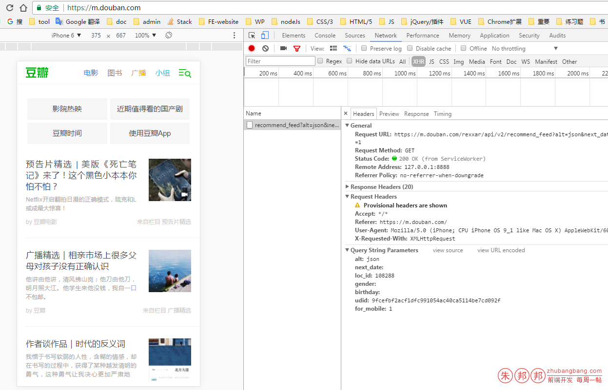
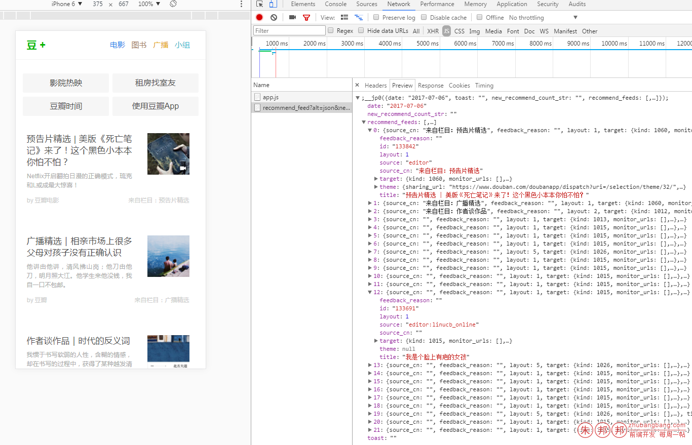

目标网站：https://m.douban.com/

希望拿到他的首页推荐数据

下面是基于VUE2的获取实现方法；这个篇文章的上一章是搭建豆瓣骨架的；

https://zhubangbang.com/vue2-imitation-phone-douban-network-vue-initialization-and-skeleton-structures.html

开始——

为了复用，把过程拆分，这样虽然文件多一些，但是多次引入的时候，很多地方可以重复使用；（从后往前分析）

- 1、直接调用 @/api/home-data.js 里的 getHomeData 方法即可 （getHomeData 这个方法是所有请求参数都配置好的）
- 2、getHomeData 这个方法是起到组织整合作用 ；配置好参数，参数可以从别的文件导入
    - 引入封好的jsonp
    - 引入配置的参数
- 3、封装Promise形式的jsonp方法
- 4、配置一些参数

### 开始实现

# 1、封装Promise形式的jsonp方法

在`src/assets/js/jsonp.js`，文件如下；是基于别人写好的jsonp直接封装的

``` 
import originJSONP from 'jsonp'
 
export default function jsonp (url, data, option) {
  url += (url.indexOf('?') > 0 ? '&' : '?') + param(data)
  return new Promise((resolve, reject) => {
    originJSONP(url, option, (err, data) => {
      if (!err) {
        resolve(data)
      } else {
        resolve(data)
      }
    })
  })
}
 
function param (data) {
  let url = ''
  for (var k in data) {
    let value = data[k] !== undefined ? data[k] : ''
    url += `&${k}=${encodeURIComponent(value)}`
  }
  return url ? url.substring(1) : ''
}

```
`package.json` 内 `dependencies` 如下


``` 
"jsonp":"^0.2.1",
```
这样就封装好一个Promise的jsonp

# 2、写 getHomeData  的方法

``` 
import jsonp from '@/assets/js/jsonp'
// import axios from 'axios'
import { homeParams } from './config'
 
export function getHomeData () {
  const url = 'https://m.douban.com/rexxar/api/v2/recommend_feed'
  const data = Object.assign({}, homeParams)
  return jsonp(url, data)
}
```

这里把刚才已经封装的JSONP引入，并且引入一个配置文件（这里是配置好的清秀参数）

# 3、config内的文件如下

``` 
export const homeParams = {
  alt: 'json',
  next_date: '',
  loc_id: 118172,
  gender: '',
  birthday: '',
  udid: '9fcefbf2acf1dfc991054ac40ca5114be7cd092f',
  for_mobile: 1
}
 
export const options = {
  param: 'jsonpCallback'
}
```

这些参数是看豆瓣搞出来的，豆瓣自己的怎么请求的，我就把他的参数复制下来的；不过我换了一台机器后，loc_id就变了；下面是豆瓣的请求参数




# 4、开始调用

``` 
<script>
  import QuickNav from '@/base/quick-nav/quick-nav.vue'
  import FeedSection from '@/base/feed-section/feed-section.vue'
  import {getHomeData} from '@/api/home-data.js'
 
  export default {
    data () {
      return {
        recommend_feeds: []
      }
    },
    components: {
      QuickNav,
      FeedSection
    },
    created () {
      this.starGetHomeData()
    },
    methods: {
      starGetHomeData () {
        getHomeData().then((res) => {
          console.log(res.recommend_feeds)
          this.recommend_feeds = res.recommend_feeds
        })
      }
    }
  }
</script>
```
下面是我在home.vue里调用的； 在组件开始创建的时候调用

``` 
this.starGetHomeData()

```
在methods里去定义一个方法

``` 
starGetHomeData () {
  getHomeData().then((res) => {
    console.log(res.recommend_feeds)
    this.recommend_feeds = res.recommend_feeds
  })
}
```
这个时候，我拿到了数据；


