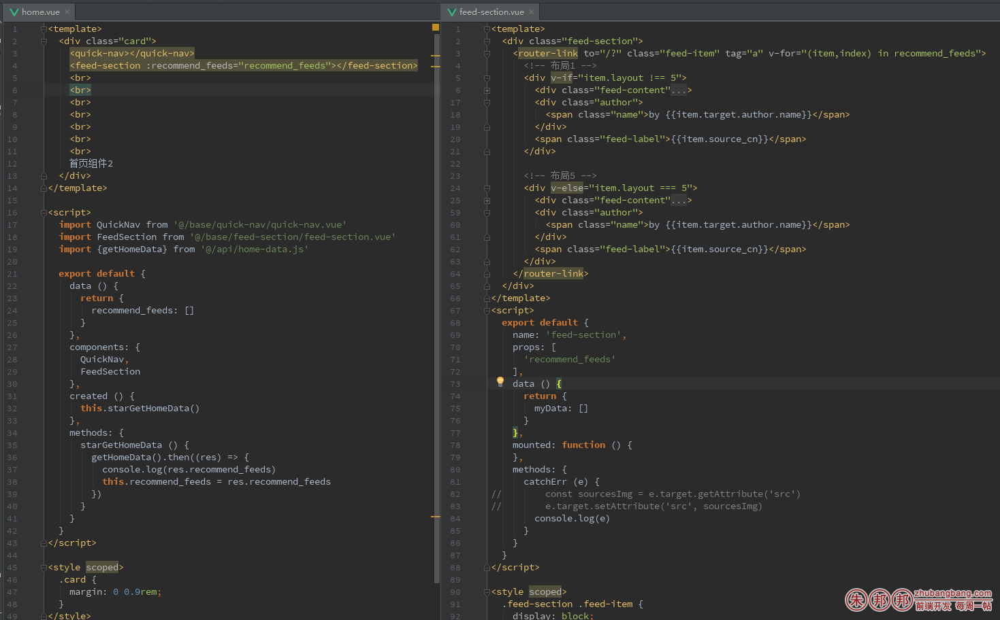

我的使用场景：

- 父组件：home.vue
- 子组件：feed-section.vue

父组件home.vue通过请求拿到数据后，传递给子组件feed-section.vue；因为在子组件中需要渲染HTML；（当然如果简单些你可以使用vue插槽；）

为了让组件完全的可复用；尽量不在父组件干涉子组件内容

实现方法：

父组件中的操作：把数据放在子组件的 :xxxxx上，这样就传过去了

``` 
<feed-section :recommend_feeds="recommend_feeds"></feed-section>
```


子附件的操作：

``` 
props: [
  'recommend_feeds'
],
```

通过props中写一个`recommend_feeds` 这样就可以拿到父组件通过`recommend_feeds`穿过来的数据了；

具体写法如下图



### home.vue的

```vue
<template>
  <div class="card">
    <quick-nav></quick-nav>
    <feed-section :recommend_feeds="recommend_feeds"></feed-section>
    <br>
    <br>
    <br>
    <br>
    <br>
    <br>
    <br>
    首页组件2
  </div>
</template>
 
<script>
  import QuickNav from '@/base/quick-nav/quick-nav.vue'
  import FeedSection from '@/base/feed-section/feed-section.vue'
  import {getHomeData} from '@/api/home-data.js'
 
  export default {
    data () {
      return {
        recommend_feeds: []
      }
    },
    components: {
      QuickNav,
      FeedSection
    },
    created () {
      this.starGetHomeData()
    },
    methods: {
      starGetHomeData () {
        getHomeData().then((res) => {
          console.log(res.recommend_feeds)
          this.recommend_feeds = res.recommend_feeds
        })
      }
    }
  }
</script>
```

### feed-section.vue中的代码

```vue
<script>
  export default {
    name: 'feed-section',
    props: [
      'recommend_feeds'
    ],
    data () {
      return {
        myData: []
      }
    },
    mounted: function () {
    },
    methods: {
      catchErr (e) {
//        const sourcesImg = e.target.getAttribute('src')
//        e.target.setAttribute('src', sourcesImg)
        console.log(e)
      }
    }
  }
</script>
```

