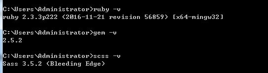
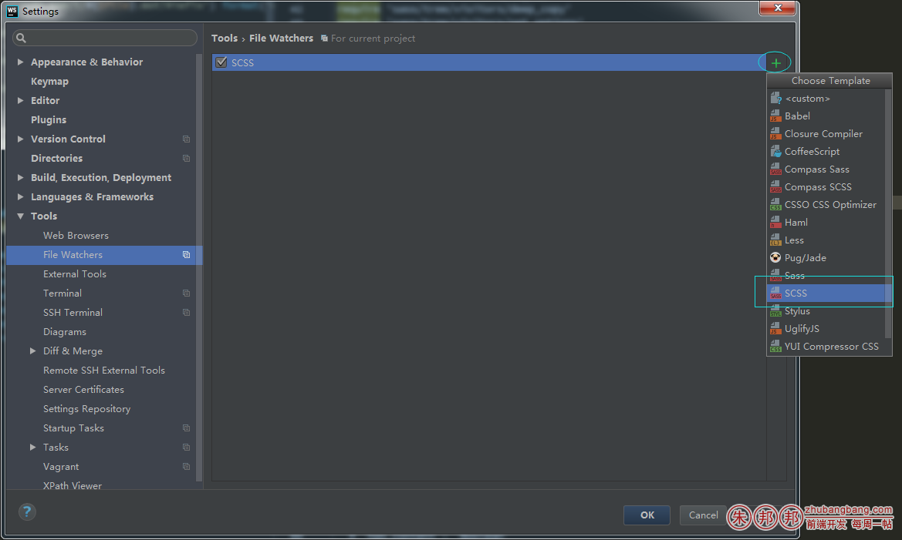
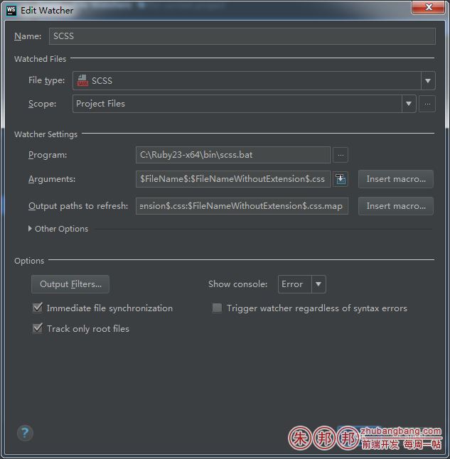
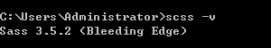
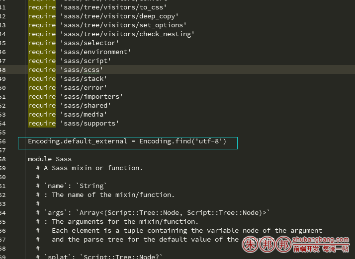

webstorm基于ruby环境sass编译中文出现sass no such files in scope 或者 sass Invalid GBK character "\xE5"的解决办法

第一个问题场景：webstorm基于ruby环境sass编译中文出现 sass no such files in scope

##### 这个时候你需要三部来走；

# 1、先检查当前的环境是否有问题；检测ruby gem scss都是否正常；



如果不正常请安装，如果正常，请进行第二步；

# 2、把原来的wacth任务删除掉，重新添加；（请注意把原来的任务删除掉，再新建一个SCSS任务）




注意：大部分的问题是出现在这一步的，可能您以前配过任务是正常的，突然有一天莫名其妙的不工作了，你需要把任务删除掉，新建一份SCSS；




对照下上图，上图是默认的配置；我没有做任何修改，如果你需要编译的路径修改，请google自行修改；

# 3、编写scass，然后保存（webstom会自动进行编译，因为你设置了watch任务啊）

比如我要编译下面的代码

```css
/* 字体文件 */
@mixin font-face($file) {
  /* IE9*/
  src: url('http://at.alicdn.com/t/#{$file}.eot');
  /* IE6-IE8 */
  src: url('http://at.alicdn.com/t/#{$file}.eot?#iefix') format('embedded-opentype'),
  /* chrome、firefox */
  url('http://at.alicdn.com/t/#{$file}.woff') format('woff'),
  /* chrome、firefox、opera、Safari, Android, iOS 4.2+*/
  url('http://at.alicdn.com/t/#{$file}.ttf') format('truetype'),
  /* iOS 4.1- */
  url('http://at.alicdn.com/t/#{$file}.svg#iconfont') format('svg');
}
@font-face {
  font-family: 'iconfont';
  @include font-face(font_77906_88lqji2222a22284zs22222adsadspvi);  /* project id："77906" */
 
}
 
.iconfont {
  display: inline-block;
  font-family: 'iconfont';
  font-style: normal;
  text-rendering: auto;
  -webkit-font-smoothing: antialiased;
  -moz-osx-font-smoothing: grayscale;
          -webkit-transform: translate(0, 0);
              -ms-transform: translate(0, 0);
                  transform: translate(0, 0);
  -webkit-text-stroke-width: 0.2px;
}
```
保存后，如果不报错，就会发现当前的 xxxx.scss文件同级有一个xxxxx.css（在编辑器里是优化成为xxxx.scss的下一级显示的）

下面引出了第二个问题；

因为我编译的scss文件中含有中文注释；

而我当前的scss是不支持中文的；所以我需要配置一下utf-8格式的支持；

SCSS的版本中，如果有中文会导致编译的时候出现sass  Invalid GBK character “\xE5″问题的错误的信息

这是编译时候的格式错误，此时需要更改 engine.rb 文件；

在engine.rb文件中加一行utf-8的设置；

代码如下：

``` 
Encoding.default_external = Encoding.find('utf-8')
```
window环境的  engine.rb 所在路径；

如果安装了多个scss版本，首先需要看下当前用的是什么版本




我用的是3.5.2这个版本；

我的路径是下面这种

``` 
C:\Ruby23-x64\lib\ruby\gems\2.3.0\gems\sass-3.5.2\lib\sass\engine.rb
```
需要修改engine.rb；

添加代码到 `require`之后；




保存即可；

这个时候已经完全可以正常工作了；