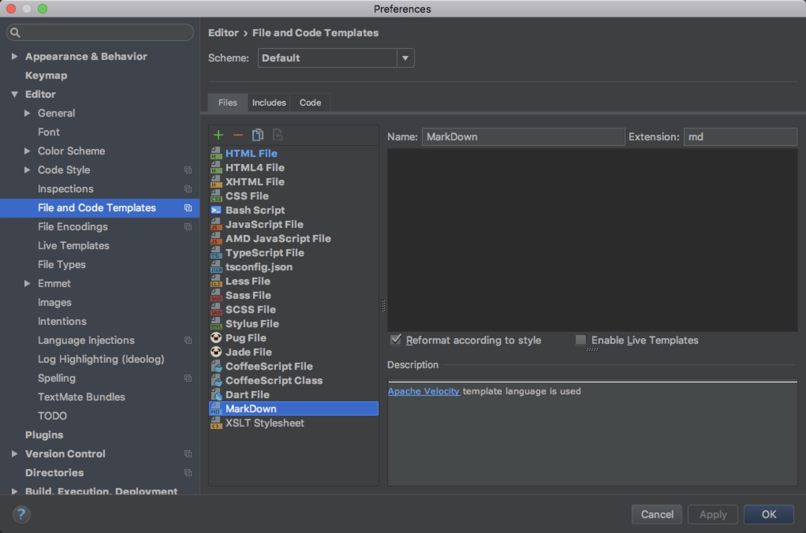

webstorm创建markdown格式文件，每次都需要 `New -> File -> XXX.md` 这么写，

非常的蛋疼，像创建JS，一般是选择JS格式，直接写个名字就可以了；

## 创建.md 类型模板

进入设置

`Preference` -> `Editor` -> `File and Code Templates` -> `Create Template`

- name 这是模板显示的名称
- extension 这是需要创建的扩展名

搞完以后，应用下就可以了,

以后创建markdown格式的文件就简单的拉；

