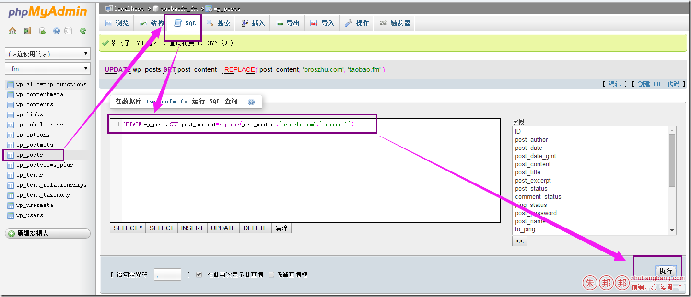

博客由broszhu.com又搬回taobao.fm了；

taobao.fm这个破域名，2个月前提示快到期了，本来是不打算续费的，
 

但是想到以前手里的一个ji.la(几点啦)这个域名因为放弃续费，过半年我又后悔了；脑门一拍还是续费了；

当初因为不想要taobao.fm了，又感觉这个域名不适合做博客的原因才转到broszhu.com现在又赚回来；想想真折腾啊！

搬来后中文图片不显示了；但是中文的图片地址打开后还是可以看到的；缩略图没有搬过来的样子；

方法很简单，在mysql里批量处理下就可以了

找到域名对应的数据库；

更新后，就OK了；

