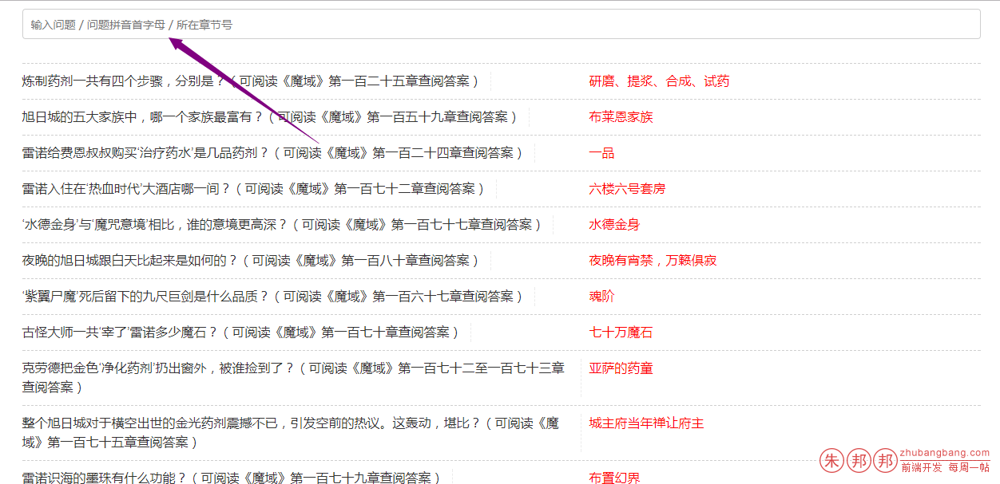
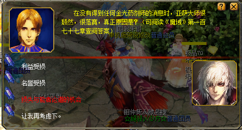

魔域小说知多少的答题器/题库：

演示地址：https://zhubangbang.com/demo/moyu-answers/index.html

源码托管在：[Github](https://github.com/zhubangbang/moyu-fiction-answers) 欢迎review源码，无任何恶意代码；

满足70级的账号（非常好升到），每天都可以得一个灵魂；

如果您是打算砸属性装的，那么这个非常适合你；

比如你每天晚上登录20个账号；加号中号，一个账号是6个号；

那么每天得灵魂的数量是：20*6=120个；

一个礼拜的话，你就可以得到120*7 = 840个灵魂

适合搬砖，一个号会有5道题目，一个人物如果你答的多了，最多十秒就能完成了；

当然，如果你的时间不多，建议你还是直接买灵魂吧；

本项目纯属业余乐趣；

为什么要使用本答题器：因为很多新手，每次答题都要翻阅小说寻找答案，这样非常浪费时间和乐趣，导致很多人后来都懒得答题了，即时偶尔答题也是胡乱蒙着选（懒得翻小说，又想碰运气拿灵魂，所以只能蒙了）；如果最开始就能一直答对，轻松拿到灵魂，这样就会越来越想答题，毕竟几秒钟就能拿到一个灵魂啊，等回答问题多了后，就几乎不用再来题库里搜索答案了，因为有很多重复的问题的，自己就能选对了；

现在的题目虽然少，但是官方后期可能会陆续放一些题目进去，那时候单靠记忆可能就很难全部答对了，所以这个题库，我会一直更新，即时以后是从几千道题目中随机选5个让你回答，那时候你也可以轻易找到答案；

在输入框里输入关键词即可；

*******************2017-10-26更新******

为了更快的搜索和提高性能，目前去掉了问题和拼音搜索；只支持问题所在的章节号搜索

比如你的问题是需要：第一百二十五章查阅答案；那么你输入125即可；

***************************以前写的**********************************

关键词可以是下面的任意一种；

- 1、问题
- 2、问题的拼音首字母（不含任何标点，大小写都可以）
- 3、问题所在的章节号

比如问题是：

`炼制药剂一共有四个步骤，分别是？（可阅读《魔域》第一百二十五章查阅答案）`

你可以输入的关键词可以有

- 1. 炼制药剂一共有四个步骤，分别是？ 或者  药剂一共有四个
- 2. lzyjygysgbzfbs 或者 ygysgbzfbs 或者 YGYSGBZFBS 或者 YGYSgbzfbs
- 3. 125

具体按照你的习惯来搜索即可；

其它说明：如果章节号是两个连续的，比如：第一百七十二至一百七十三章查阅答案；这个时候章节号输入是 172173 即可

如果发现有遗漏的题目，欢迎发邮件通知我

地址：www#zhubangbang.com (把#改为@即可)

邮件内请附上缺失的题目截图；截图格式推荐下面这种

答题面板全部有的（截图或照片中，含有完整的问题和答案）